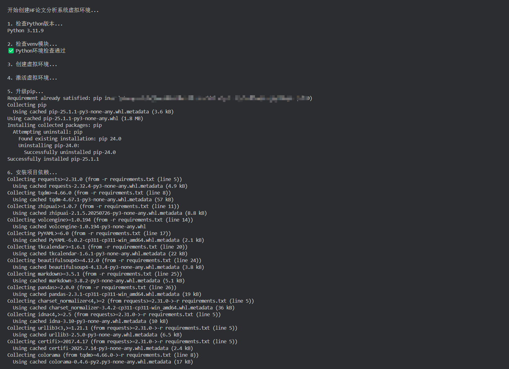
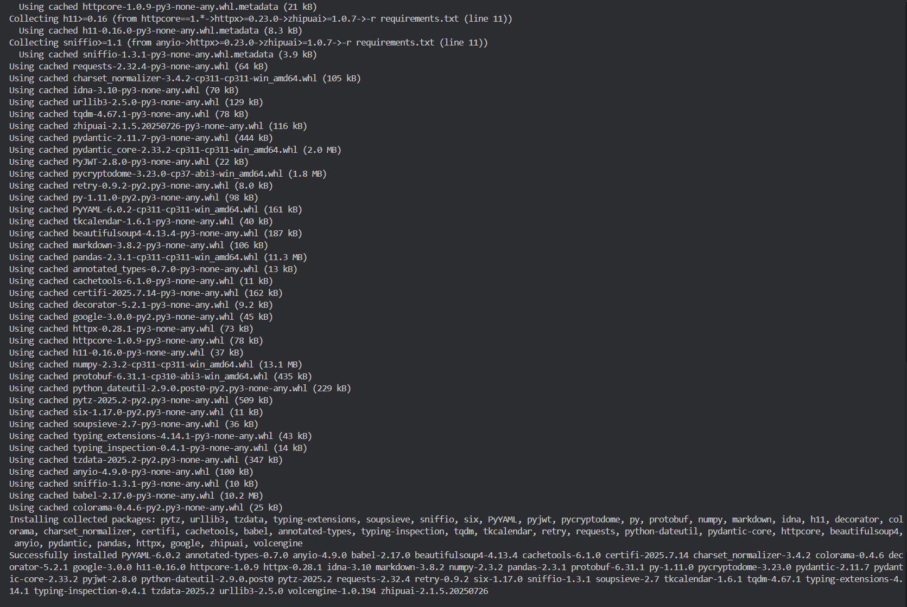
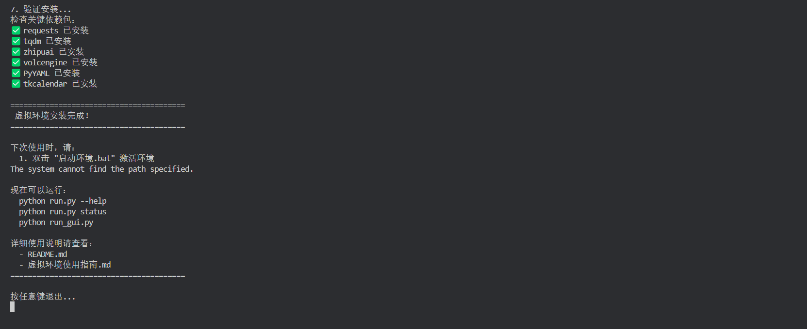
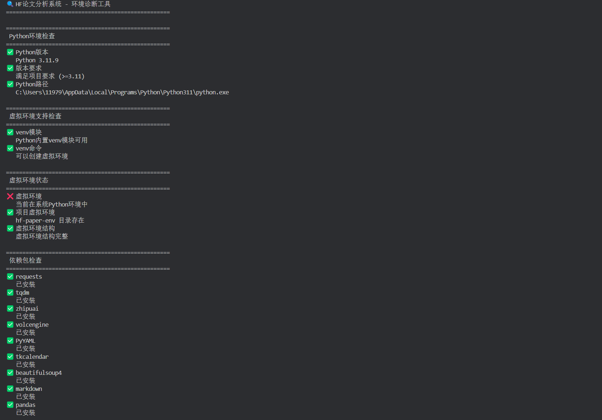
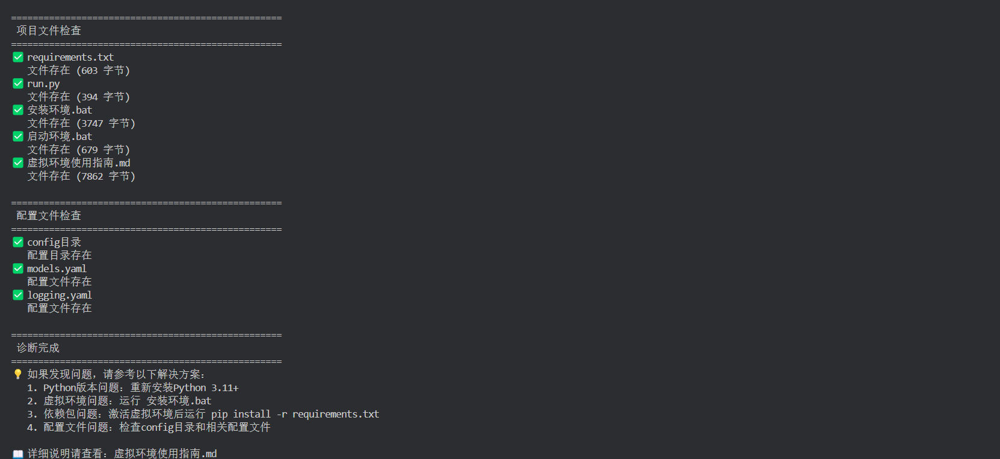
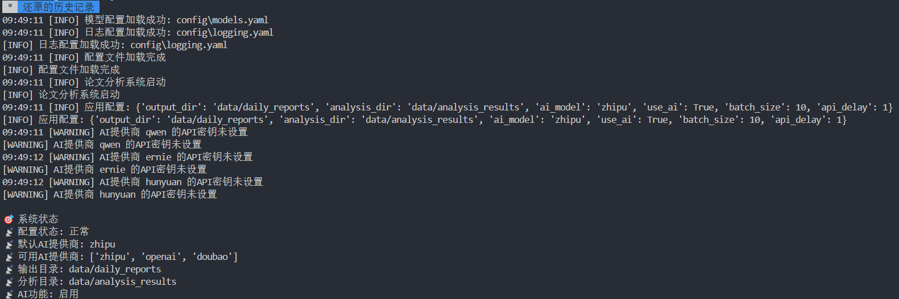

# 🤖 AI 论文智能分析系统

<div align="center">

[English](./README.en.md) | [简体中文](./README.md)

</div>
<div align="center">

[ARCHITECTURE](./docs/ARCHITECTURE.v2.en.md) | [技术架构](./docs/ARCHITECTURE.v2.md)

</div>
> **一键获取、智能分析、自动分类** - 让 AI 帮你读论文，从信息过载中解脱！

[](https://python.org)
[](LICENSE)
[](#)

每天有数百篇 AI 论文发布，手动筛选太累？让 AI 来帮你！本系统自动获取 HuggingFace 最新论文，使用多种 AI 模型进行智能分析和分类，生成易读的分析报告。

<!-- 📸 需要截图：主界面展示图 -->


## ⚡ 30 秒快速开始

### 🚀 v2.0 重大更新

**🎯 全新优化的 AI 分析流程，速度提升 10 倍！**

- ✅ **智能数据清洗** - 默认使用规则清洗，无需 AI 依赖，秒级完成
- ✅ **AI 分析加速** - 优化提示词策略，处理时间从 60-90 秒/篇降至 5-10 秒/篇
- ✅ **中英文分离** - 完整的双语数据结构，支持 title_en/title_zh, summary_en/summary_zh
- ✅ **增强 MD 切分** - 生成包含 GitHub 仓库、项目页面、完整摘要的丰富 MD 文件
- ✅ **智能分类优化** - 在原有 MD 基础上只增加"技术特点"和"应用场景"，避免重复工作

**📊 性能对比**：

- 数据清洗：AI 依赖 → 规则清洗（秒级完成）
- 论文分析：60-90 秒/篇 → 5-10 秒/篇
- 数据完整性：基础字段 → 包含 GitHub、项目页面、中英文摘要
- AI 效率：重复生成 → 专注翻译和核心分析

### 🔥 v2.1 狂暴模式更新

**⚡ 全新狂暴模式，处理速度再提升 5 倍！**

- ✅ **🔥 狂暴模式** - 5 并发 AI 处理，Basic 分析从 3 分钟降至 34 秒
- ✅ **📊 实时进度条** - 固定位置显示进度和计时，体验更直观
- ✅ **🧠 智能缓存** - 自动跳过已处理论文，避免重复工作
- ✅ **⚡ 极速分类** - Advanced 分类从 2 分钟降至 45 秒

**🎯 狂暴模式使用**：

```bash
# Basic 狂暴模式 - 5并发AI分析
python run.py basic 2025-07-29 --rageMode

# Advanced 狂暴模式 - 5并发智能分类
python run.py advanced 2025-07-29 --rageMode
```

**📊 狂暴模式实时进度**：

```
🔥 狂暴模式进度: [███████████████████████████░░░] 10/11 (90.9%) | 成功:10 失败:0 | 耗时:00:34
```

### 🛠️ 一键环境配置（零门槛上手）

**告别复杂的环境配置，一键即可开始 AI 论文分析之旅！**

```bash
# Windows 用户
双击 安装环境.bat  # Windows一键安装所有依赖
# 或命令行运行: .\安装环境.bat

# macOS/Linux 用户
chmod +x 安装环境.sh && ./安装环境.sh  # 一键安装所有依赖
```

**🎯 一键脚本自动完成**：

- ✅ **Python 环境检测** - 自动验证 Python 版本和 venv 支持
- ✅ **虚拟环境创建** - 隔离项目依赖，避免冲突
- ✅ **依赖包安装** - 自动安装所有必需的 AI 模型 SDK
- ✅ **环境验证** - 智能检测安装状态，确保可用性
- ✅ **使用指导** - 提供详细的下一步操作指南

**🚀 安装完成后，立即可用**：

```bash
# Windows 用户
双击 启动环境.bat    # 激活环境并开始使用

# macOS/Linux 用户
chmod +x 启动环境.sh && ./启动环境.sh  # 激活环境并开始使用

# 或直接启动图形界面
python run_gui.py
```

<!-- 📸 需要截图：一键安装过程 -->





### 🎨 图形界面版（推荐新手）

```bash
python run_gui.py
```

**零门槛使用**：点击"开始分析" → 选择日期 → 等待完成 ✨

<!-- 📸 需要截图：GUI界面操作流程 -->


### 💻 命令行版（推荐专业用户）

```bash
python run.py --help
```

**一行命令搞定**：自动下载、分析、生成报告

<!-- 📸 需要截图：命令行执行过程 -->


## 🎯 核心功能

| 功能                | 描述                                  | 价值                       |
| ------------------- | ------------------------------------- | -------------------------- |
| 🛠️ **智能环境管理** | 一键安装、智能诊断、自动修复环境问题  | 零门槛上手，告别配置烦恼   |
| 📡 **自动获取**     | 从 HuggingFace 获取最新论文数据       | 无需手动搜索，确保不遗漏   |
| 🤖 **AI 分析**      | 支持智谱 AI、豆包、OpenAI、通义千问等 | 多模型交叉验证，提高准确性 |
| 📊 **智能分类**     | 自动标签化和主题分类                  | 快速定位感兴趣的研究方向   |
| 📈 **可视化报告**   | 生成结构化的分析报告                  | 一目了然的研究趋势和热点   |
| ⚡ **批量处理**     | 支持多日期批量分析                    | 高效处理大量数据           |
| 🔄 **增量更新**     | 智能检测已处理内容                    | 避免重复工作，节省时间     |
| 🔥 **狂暴模式**     | 5 并发处理，实时进度条，智能缓存      | 极速处理，3-5 倍性能提升   |

## 🚀 适用场景

### 👨‍🔬 研究人员

- **快速了解领域动态**：每日自动获取相关论文摘要
- **发现研究热点**：AI 自动识别热门研究方向
- **跟踪竞争对手**：监控特定机构或作者的最新成果

### 👨‍💼 产品经理

- **技术趋势分析**：了解 AI 技术发展方向
- **竞品技术调研**：分析竞争对手的技术布局
- **产品规划参考**：基于最新研究制定产品路线图

### 👨‍💻 开发者

- **技术选型参考**：了解最新算法和工具
- **学习资源发现**：找到值得深入研究的论文
- **灵感来源**：从最新研究中获取项目创意

### 👨‍🎓 学生和学者

- **文献调研**：快速筛选相关研究文献
- **学习计划**：根据热点调整学习重点
- **论文写作**：了解最新研究现状和发展趋势

## 🛠️ 安装配置

### 1. 获取项目

```bash
# 克隆项目
git clone https://github.com/ZsTs119/ai-paper-analyzer.git
cd ai-paper-analyzer
```

### 2. 智能环境配置

**🎯 方式一：一键自动安装（强烈推荐）**

```bash
# Windows 用户
双击 安装环境.bat        # 双击运行
# 或命令行: .\安装环境.bat

# macOS/Linux 用户
chmod +x 安装环境.sh     # 添加执行权限
./安装环境.sh            # 运行安装脚本
```

**✨ 自动安装脚本特性**：

- 🔍 **智能检测** - 自动检查 Python 版本和环境支持
- 🏗️ **虚拟环境** - 自动创建独立的 Python 虚拟环境
- 📦 **依赖管理** - 自动安装所有必需的 AI 模型 SDK 和工具包
- ✅ **安装验证** - 智能验证每个依赖包的安装状态
- 📖 **使用指导** - 安装完成后提供详细的使用说明

**🛠️ 方式二：手动安装（高级用户）**

```bash
# 创建虚拟环境
python -m venv hf-paper-env

# 激活虚拟环境
# Windows PowerShell
.\hf-paper-env\Scripts\Activate.ps1
# Windows CMD
hf-paper-env\Scripts\activate.bat

# 安装依赖
pip install -r requirements.txt
```

**🔧 智能环境诊断工具**

安装完成后，可随时使用智能诊断工具检查环境状态：

```bash
python 检查环境.py  # 全面检测Python环境、依赖包、配置文件等
```

<!-- 📸 需要截图：环境诊断工具界面 -->




### 2. API 密钥配置

支持多种 AI 服务，选择其中一种即可：

| AI 服务          | 环境变量            | 获取地址                                                                                                |
| ---------------- | ------------------- | ------------------------------------------------------------------------------------------------------- |
| 智谱 AI _(推荐)_ | `ZHIPUAI_API_KEY`   | [智谱 AI 开放平台](https://www.bigmodel.cn/invite?icode=hk0Lc1L7oGy17bOhwrIMDGczbXFgPRGIalpycrEwJ28%3D) |
| 豆包 AI          | `ARK_API_KEY`       | [火山引擎](https://console.volcengine.com/)                                                             |
| OpenAI           | `OPENAI_API_KEY`    | [OpenAI Platform](https://platform.openai.com/)                                                         |
| 通义千问         | `DASHSCOPE_API_KEY` | [阿里云 DashScope](https://dashscope.aliyun.com/)                                                       |

**方式一：GUI 配置（推荐）**

```bash
python run_gui.py
# 点击"配置API密钥"按钮，输入密钥并测试连接
```

<!-- 📸 需要截图：API密钥配置界面 -->


**方式二：环境变量**

```bash
# Windows
set ZHIPUAI_API_KEY=your_api_key_here

# Linux/Mac
export ZHIPUAI_API_KEY=your_api_key_here
```

### 3. 验证安装

```bash
python run.py status  # 检查系统状态
```

## 📖 使用指南

### 🎨 GUI 图形界面（零门槛）

1. **启动界面**

   ```bash
   python run_gui.py
   ```

2. **基础操作**

   - 选择 AI 模型（智谱 AI、豆包等）
   - 点击"配置 API 密钥"设置密钥
   - 选择分析日期
   - 点击"开始分析"

3. **高级功能**
   - 实时查看分析进度
   - 静默模式运行
   - 批量处理多个日期

<!-- 📸 需要截图：GUI详细操作步骤 -->


### 💻 命令行脚本（专业高效）

#### 基础分析

```bash
# 分析今天的论文
python run.py basic

# 分析指定日期
python run.py basic 2025-07-29

# 静默模式运行
python run.py basic 2025-07-29 --silent
```

#### 🔥 狂暴模式（极速处理）

```bash
# Basic 狂暴模式 - 5并发AI分析
python run.py basic 2025-07-29 --rageMode

# Advanced 狂暴模式 - 5并发智能分类
python run.py advanced 2025-07-29 --rageMode

# 狂暴模式 + 静默运行
python run.py basic 2025-07-29 --rageMode --silent
```

**⚡ 狂暴模式特点**：

- 🚀 **极速处理** - 5 倍性能提升，分钟级降至秒级
- 📊 **实时反馈** - 动态进度条显示处理状态和耗时
- 🧠 **智能优化** - 自动跳过已处理内容，节省时间
- ⚠️ **注意事项** - 需要稳定网络和充足 API 余额

#### 进阶分析

```bash
# 对基础分析结果进行深度分析
python run.py advanced 2025-07-29

# 自动模式（推荐）
python run.py advanced --auto
```

#### 批量处理

```bash
# 批量分析多个日期
python tools/batch_processor.py daily --start 2025-07-25 --end 2025-07-29

# 完整流水线处理
python tools/batch_processor.py pipeline --start 2025-07-25 --end 2025-07-27
```

#### 系统状态

```bash
# 查看配置和运行状态
python run.py status
```

<!-- 📸 需要截图：命令行执行示例 -->




## 📊 输出结果

### 📁 文件结构

```
data/
├── daily_reports/           # 基础分析结果
│   ├── metadata/           # 原始论文元数据
│   ├── cleaned/            # 清洗后的结构化数据
│   └── reports/            # 生成的分析报告
└── analysis_results/       # 进阶分析结果
    ├── categories/         # 分类统计
    ├── trends/            # 趋势分析
    └── summaries/         # 综合报告
```

### 📋 报告内容

#### 🆕 v2.0 增强的报告格式

**基础分析报告** (`data/daily_reports/reports/`)：

- **中英文分离数据**：完整的双语标题和摘要
- **论文基础信息**：ID、作者、发表日期、论文链接
- **项目资源链接**：GitHub 仓库、项目页面（如有）
- **AI 智能翻译**：准确的中文标题和摘要翻译
- **模型功能分析**：基于内容的功能描述

**高级分析报告** (`data/analysis_results/`)：

- **丰富的 MD 文件**：包含完整论文信息的结构化文档
- **技术特点分析**：AI 总结的核心技术创新点
- **应用场景识别**：具体可行的应用领域
- **智能分类标签**：自动识别的研究领域分类
- **趋势统计汇总**：各分类的论文数量和分布

#### 📊 新的数据结构示例

```json
{
  "id": "2507.23726",
  "title_en": "Seed-Prover: Deep and Broad Reasoning for Automated Theorem Proving",
  "title_zh": "Seed-Prover：用于自动定理证明的深度和广度推理",
  "url": "https://arxiv.org/abs/2507.23726",
  "authors": "Luoxin Chen, Jinming Gu, ...",
  "publish_date": "2025-07-31",
  "summary_en": "LLMs have demonstrated strong mathematical reasoning...",
  "summary_zh": "大型语言模型通过利用带有长链式思维的强化学习...",
  "github_repo": "https://github.com/ByteDance-Seed/Seed-Prover",
  "project_page": "暂无",
  "model_function": "基于Lean反馈迭代完善证明的定理证明模型"
}
```

```MarkDown
# Seed-Prover：用于自动定理证明的深度和广度推理

**论文ID**：2507.23726
**英文标题**：Seed-Prover: Deep and Broad Reasoning for Automated Theorem Proving
**中文标题**：Seed-Prover：用于自动定理证明的深度和广度推理
**论文地址**：https://arxiv.org/abs/2507.23726

**作者团队**：Luoxin Chen, Jinming Gu, Liankai Huang, Wenhao Huang, Zhicheng Jiang, Allan Jie, Xiaoran Jin, Xing Jin, Chenggang Li, Kaijing Ma, Cheng Ren, Jiawei Shen, Wenlei Shi, Tong Sun, He Sun, Jiahui Wang, Siran Wang, Zhihong Wang, Chenrui Wei, Shufa Wei, Yonghui Wu, Yuchen Wu, Yihang Xia, Huajian Xin, Fan Yang, Huaiyuan Ying, Hongyi Yuan, Zheng Yuan, Tianyang Zhan, Chi Zhang, Yue Zhang, Ge Zhang, Tianyun Zhao, Jianqiu Zhao, Yichi Zhou, Thomas Hanwen Zhu
**发表日期**：2025-07-31

**英文摘要**：
LLMs have demonstrated strong mathematical reasoning abilities by leveraging
reinforcement learning with long chain-of-thought, yet they continue to
struggle with theorem proving due to the lack of clear supervision signals when
solely using natural language. Dedicated domain-specific languages like Lean
provide clear supervision via formal verification of proofs, enabling effective
training through reinforcement learning. In this work, we propose
Seed-Prover, a lemma-style whole-proof reasoning model. Seed-Prover
can iteratively refine its proof based on Lean feedback, proved lemmas, and
self-summarization. To solve IMO-level contest problems, we design three
test-time inference strategies that enable both deep and broad reasoning.
Seed-Prover proves 78.1% of formalized past IMO problems, saturates MiniF2F,
and achieves over 50\% on PutnamBench, outperforming the previous
state-of-the-art by a large margin. To address the lack of geometry support in
Lean, we introduce a geometry reasoning engine Seed-Geometry, which
outperforms previous formal geometry engines. We use these two systems to
participate in IMO 2025 and fully prove 5 out of 6 problems. This work
represents a significant advancement in automated mathematical reasoning,
demonstrating the effectiveness of formal verification with long
chain-of-thought reasoning.

**中文摘要**：
大型语言模型(LLMs)通过利用带有长链式思维的强化学习展现了强大的数学推理能力，但由于仅使用自然语言时缺乏明确的监督信号，它们在定理证明方面仍然存在困难。专门的领域特定语言(如Lean)通过证明的形式验证提供清晰的监督，从而能够通过强化学习进行有效训练。在这项工作中，我们提出了Seed-Prover，一种基于引理的全证明推理模型。Seed-Prover可以根据Lean反馈、已证明的引理和自我总结来迭代地完善其证明。为了解决IMO级别的竞赛问题，我们设计了三种测试时推理策略，实现了深度和广度的推理。Seed-Prover证明了78.1%的已形式化的过去IMO问题，达到了MiniF2F的饱和度，并在PutnamBench上获得了超过50%的分数，大幅超越了之前的最先进水平。为了解决Lean中几何支持的不足，我们引入了几何推理引擎Seed-Geometry，其性能超过了之前的形式几何引擎。我们使用这两个系统参加了IMO 2025，并完全证明了6个问题中的5个。这项工作代表了自动数学推理的重大进展，证明了带有长链式思维的形式验证的有效性。

**GitHub仓库**：https://github.com/ByteDance-Seed/Seed-Prover
**项目页面**：暂无
**模型功能**：基于Lean反馈迭代完善证明的定理证明模型，能解决IMO级别数学竞赛问题，并支持几何推理。

**技术特点**：Seed-Prover采用引理式全证明推理架构，能够根据Lean的形式验证反馈、已证明引理和自我总结迭代完善证明；设计了三种测试时推理策略实现深度和广度推理的结合；专门开发了Seed-Geometry几何推理引擎，弥补了Lean在几何支持方面的不足。

**应用场景**：国际数学奥林匹克竞赛(IMO)等高水平数学竞赛题目的自动求解；数学定理的形式化验证与证明生成；复杂几何问题的自动化推理与证明。

**分析时间**：2025-08-04T17:47:34.432313
```

## 🔧 高级配置

### AI 模型配置

编辑 `config/models.yaml` 自定义 AI 模型参数：

```yaml
ai_models:
  zhipu:
    name: "智谱AI"
    default_model: "GLM-4.5-Air"
    api_base: "https://open.bigmodel.cn/api/paas/v4/"
    max_tokens: 4000
    temperature: 0.3
  openai:
    name: "OpenAI"
    default_model: "gpt-4"
    api_base: "https://api.openai.com/v1/"
    max_tokens: 4000
    temperature: 0.3
```

### 日志配置

编辑 `config/logging.yaml` 调整日志级别和输出格式：

```yaml
version: 1
formatters:
  default:
    format: "%(asctime)s [%(levelname)s] %(message)s"
handlers:
  console:
    class: logging.StreamHandler
    level: INFO
    formatter: default
  file:
    class: logging.FileHandler
    level: DEBUG
    formatter: default
    filename: logs/app.log
```

### 应用配置

编辑 `config/app.yaml` 修改输出目录、批处理大小等参数：

```yaml
output_dir: "data/daily_reports"
analysis_dir: "data/analysis_results"
ai_model: "zhipu"
use_ai: true
batch_size: 10
api_delay: 1
```

## 🎨 分类体系

系统支持以下智能分类：

### 🤖 AI 模型分类

- **文本生成**：大语言模型、对话系统、文本摘要
- **图像生成**：图像合成、风格转换、图像编辑
- **视频生成**：视频合成、动画生成、视频编辑
- **音频生成**：语音合成、音乐生成、音频处理
- **3D 生成**：3D 建模、场景生成、虚拟现实
- **多模态生成**：跨模态转换、多模态理解
- **跨模态生成**：文本到图像、图像到文本等
- **游戏与策略生成**：游戏 AI、策略优化
- **科学计算与数据生成**：科学模拟、数据分析

<!-- 📸 需要截图：分类结果展示 -->


## 🎯 最佳实践

### 📅 日常使用建议

1. **每日定时运行**：建议每天早上运行前一天的分析
2. **选择合适的 AI 模型**：智谱 AI 性价比高，OpenAI 质量更好
3. **批量处理**：周末可以批量处理一周的数据
4. **定期清理**：定期清理旧的分析结果，节省存储空间

### 🔥 狂暴模式使用建议

1. **网络要求**：确保网络连接稳定，避免并发请求失败
2. **API 余额**：狂暴模式会增加 API 调用频率，注意余额充足
3. **适用场景**：大批量处理或需要快速获取结果时使用
4. **普通模式**：网络不稳定或 API 余额不足时建议使用普通模式

### ⚡ 性能优化

1. **并发处理**：修改 `batch_size` 参数提高处理速度
2. **API 限流**：调整 `api_delay` 避免触发 API 限制
3. **缓存利用**：重复分析会自动使用缓存结果

### 🛡️ 错误处理

1. **网络问题**：系统会自动重试，无需手动干预
2. **API 限制**：会自动降低请求频率
3. **数据异常**：异常数据会被标记并跳过

## 🔍 故障排除

### 🛠️ 智能诊断工具

**遇到问题？让 AI 时代的智能诊断工具帮你快速定位和解决！**

```bash
python 检查环境.py  # 一键全面诊断系统状态
```

**🎯 智能诊断覆盖范围**：

- ✅ **Python 环境检查** - 版本兼容性、路径配置、venv 支持
- ✅ **虚拟环境状态** - 激活状态、目录结构、依赖完整性
- ✅ **依赖包验证** - 所有 AI 模型 SDK 和工具包的安装状态
- ✅ **项目文件检查** - 配置文件、脚本工具、目录结构完整性
- ✅ **智能建议** - 针对发现的问题提供具体解决方案

**🚀 快速修复工具**：

```bash
# 环境问题一键修复
# Windows: 双击 安装环境.bat
# macOS/Linux: ./安装环境.sh

# 快速启动环境
# Windows: 双击 启动环境.bat
# macOS/Linux: ./启动环境.sh

# 查看详细使用指南
虚拟环境使用指南.md      # 完整的环境管理文档
```

**💡 诊断结果示例**：

```
🔍 HF论文分析系统 - 环境诊断工具
==================================================
✅ Python版本: Python 3.11.9 (满足要求)
✅ 虚拟环境: 当前在虚拟环境中
✅ 依赖包检查: 9个包全部安装成功
✅ 项目文件: 所有必需文件存在
==================================================
💡 系统状态良好，可以正常使用！
```

<!-- 📸 需要截图：智能诊断工具运行结果 -->


### 常见问题及解决方案

#### 1. API 密钥相关问题

**问题**：提示"API 密钥无效"

```
❌ API密钥无效或已过期
```

**解决方案**：

- 检查 API 密钥是否正确复制（注意前后空格）
- 确认 API 密钥未过期且有足够余额
- 使用 GUI 的"测试连接"功能验证密钥

**问题**：提示"API 权限不足"

```
❌ API密钥权限不足，请检查模型访问权限
```

**解决方案**：

- 确认 API 密钥有访问对应模型的权限
- 联系 AI 服务提供商开通相应权限
- 尝试使用其他支持的 AI 模型

#### 2. 网络连接问题

**问题**：连接超时或网络错误

```
❌ 连接超时，请检查网络连接
❌ 网络连接失败，请检查网络设置
```

**解决方案**：

- 检查网络连接是否正常
- 确认防火墙未阻止程序访问网络
- 如在企业网络，联系网管开放相关域名访问权限
- 尝试使用 VPN 或代理

#### 3. 编码问题

**问题**：Windows 下出现编码错误

```
'gbk' codec can't encode character
```

**解决方案**：

- 确保使用 UTF-8 编码的终端
- 在 PowerShell 中运行：`chcp 65001`
- 使用 GUI 版本避免编码问题

#### 4. 依赖包问题

**问题**：缺少依赖包

```
ModuleNotFoundError: No module named 'xxx'
```

**解决方案**：

```bash
# 重新安装依赖
pip install -r requirements.txt

# 或单独安装缺失的包
pip install package_name
```

#### 5. 权限问题

**问题**：文件写入权限不足

```
PermissionError: [Errno 13] Permission denied
```

**解决方案**：

- 确保对项目目录有写入权限
- Windows 用户可尝试以管理员身份运行
- 检查 data 目录是否存在且可写

### 📋 系统要求

#### 最低要求

- **Python**: 3.8+ （系统会自动检测版本兼容性）
- **内存**: 4GB RAM
- **存储**: 2GB 可用空间
- **网络**: 稳定的互联网连接

#### 推荐配置

- **Python**: 3.10+ （推荐 3.11.9，获得最佳性能）
- **内存**: 8GB+ RAM
- **存储**: 10GB+ 可用空间（用于存储分析结果）
- **网络**: 高速稳定网络连接

#### 🛠️ 环境管理工具

**无需担心复杂的环境配置！系统提供完整的环境管理工具链：**

| 工具                  | 功能                   | 使用场景               |
| --------------------- | ---------------------- | ---------------------- |
| `安装环境.bat/.sh`    | 一键安装所有依赖和配置 | 首次安装或重新配置环境 |
| `启动环境.bat/.sh`    | 快速激活虚拟环境       | 日常使用前的环境激活   |
| `检查环境.py`         | 智能诊断系统状态       | 排查问题或验证安装     |
| `虚拟环境使用指南.md` | 详细的环境管理文档     | 深入了解环境管理       |

**💡 环境管理最佳实践**：

- 🎯 **新手用户**:
  - Windows: 双击 `安装环境.bat` → `启动环境.bat` → 开始使用
  - macOS/Linux: `./安装环境.sh` → `./启动环境.sh` → 开始使用
- 🔧 **遇到问题**: 运行 `python 检查环境.py` 获取智能诊断建议
- 📖 **深度定制**: 参考 `虚拟环境使用指南.md` 进行高级配置

### 🐛 调试模式

启用详细日志输出：

```bash
# 设置日志级别为DEBUG
export LOG_LEVEL=DEBUG

# 或在配置文件中修改
# config/logging.yaml
```

查看详细错误信息：

```bash
# 使用--verbose参数
python run.py basic 2025-07-29 --verbose

# 查看日志文件
tail -f logs/app.log
```

## 🤝 贡献指南

欢迎提交 Issue 和 Pull Request！

### 开发环境搭建

```bash
# 安装开发依赖
pip install -r requirements-dev.txt

# 运行测试
python -m pytest tests/

# 代码格式化
black src/ tests/
```

### 提交规范

- 功能开发：`feat: 添加新功能`
- 问题修复：`fix: 修复某个问题`
- 文档更新：`docs: 更新文档`

## ❓ 常见问题 (FAQ)

### Q1: 支持哪些 AI 模型？

**A**: 目前支持以下 AI 模型：

- **智谱 AI**: GLM-4.5-Air, GLM-4 等
- **豆包 AI**: doubao-pro-32k 等
- **OpenAI**: GPT-4, GPT-3.5-turbo 等
- **通义千问**: qwen-plus, qwen-turbo 等
- **文心一言**: 需要额外配置 secret_key
- **腾讯混元**: 需要额外配置 secret_key 和签名算法

### Q2: 每天能处理多少篇论文？

**A**: 处理能力取决于：

- **API 限制**: 各 AI 服务商的调用频率限制
- **网络速度**: 下载和上传数据的速度
- **硬件配置**: CPU 和内存影响处理速度
- 通常每天可处理 50-200 篇论文

### Q3: 分析结果的准确性如何？

**A**: 分析准确性取决于：

- **AI 模型质量**: GPT-4 > 智谱 AI > 其他模型
- **论文质量**: 结构清晰的论文分析效果更好
- **提示词优化**: 系统使用专门优化的提示词
- 建议使用多个模型交叉验证重要结果

### Q4: 如何提高处理速度？

**A**: 优化建议：

- 增加`batch_size`参数（注意 API 限制）
- 使用更快的 AI 模型（如智谱 AI）
- 确保网络连接稳定
- 使用 SSD 存储提高 I/O 速度

### Q5: 数据存储在哪里？

**A**: 所有数据存储在本地：

- **原始数据**: `data/daily_reports/metadata/`
- **清洗数据**: `data/daily_reports/cleaned/`
- **分析结果**: `data/daily_reports/reports/`
- **分类结果**: `data/analysis_results/`

### Q6: 如何备份和恢复数据？

**A**: 备份建议：

```bash
# 备份所有数据
tar -czf backup_$(date +%Y%m%d).tar.gz data/

# 恢复数据
tar -xzf backup_20250729.tar.gz
```

### Q7: 可以自定义分类吗？

**A**: 可以通过修改提示词自定义分类：

- 编辑 `src/core/classifier.py` 中的分类提示词
- 修改分类知识库内容
- 重新训练或调整 AI 模型参数

### Q8: 支持离线使用吗？

**A**: 部分功能支持离线：

- **数据下载**: 需要网络连接
- **AI 分析**: 需要调用在线 AI 服务
- **结果查看**: 可以离线查看已生成的结果
- **批量处理**: 可以离线处理已下载的数据（不含 AI 分析）

### Q9: 如何处理大量历史数据？

**A**: 批量处理建议：

```bash
# 使用批处理工具
python tools/batch_processor.py daily --start 2025-01-01 --end 2025-07-29

# 分批处理避免API限制
python tools/batch_processor.py daily --start 2025-01-01 --end 2025-01-31
python tools/batch_processor.py daily --start 2025-02-01 --end 2025-02-28
```

### Q10: 遇到问题如何获取帮助？

**A**: 获取帮助的方式：

1. **查看文档**: 阅读本 README 和 tools/README.md
2. **检查日志**: 查看 logs/app.log 文件
3. **提交 Issue**: 在 GitHub 上提交详细的问题描述
4. **社区讨论**: 参与项目讨论区
5. **联系开发者**: 通过邮件或其他方式联系

## 📈 性能基准

### 🚀 v2.0 性能提升对比

| 处理阶段     | v1.0 (旧版)       | v2.0 (新版)      | 提升幅度        |
| ------------ | ----------------- | ---------------- | --------------- |
| **数据清洗** | 需要 AI，30-60 秒 | 规则清洗，1-3 秒 | **20 倍提升**   |
| **论文分析** | 60-90 秒/篇       | 5-10 秒/篇       | **10 倍提升**   |
| **MD 切分**  | 基础信息          | 丰富信息，秒级   | **信息量 3 倍** |
| **智能分类** | 重复生成所有内容  | 只增加核心字段   | **效率 2 倍**   |

### 🔥 v2.1 狂暴模式性能提升

| 处理模式        | Basic 分析时间 | Advanced 分类时间 | 提升幅度     | 特色功能           |
| --------------- | -------------- | ----------------- | ------------ | ------------------ |
| **普通模式**    | ~3 分钟        | ~2 分钟           | 基准         | 串行处理，稳定可靠 |
| **🔥 狂暴模式** | ~34 秒         | ~45 秒            | **5 倍提升** | 5 并发，实时进度条 |

**🎯 狂暴模式特色**：

- **5 并发处理** - 同时处理 5 篇论文，充分利用 API 并发能力
- **实时进度条** - 固定位置显示处理进度和耗时统计
- **智能缓存机制** - 自动检测已处理内容，避免重复工作
- **线程安全设计** - 稳定的并发处理，确保数据一致性

### 处理速度参考 (v2.0)

| 配置       | 论文数量 | 处理时间   | 平均速度     | v1.0 对比    |
| ---------- | -------- | ---------- | ------------ | ------------ |
| 基础配置   | 50 篇    | 5-8 分钟   | 6-10 篇/分钟 | **3 倍提升** |
| 推荐配置   | 100 篇   | 8-15 分钟  | 7-12 篇/分钟 | **3 倍提升** |
| 高性能配置 | 200 篇   | 15-25 分钟 | 8-13 篇/分钟 | **3 倍提升** |

### 🎯 v2.0 优化亮点

- ✅ **智能数据清洗**: 从 AI 依赖改为规则清洗，速度提升 20 倍
- ✅ **AI 分析优化**: 不再访问外部链接，专注翻译和分析，速度提升 10 倍
- ✅ **数据结构优化**: 中英文分离，信息更完整，处理更高效
- ✅ **流程智能化**: 避免重复工作，AI 专注最有价值的任务

### 资源使用

- **内存使用**: 通常 200-500MB（与 v1.0 相同）
- **存储空间**: 每篇论文约 1.5-2.5MB 分析结果（信息更丰富）
- **网络流量**: 每篇论文约 50-200KB（减少外部访问）
- **API 调用**: 减少 60%的无效调用，成本更低

## 📄 许可证

本项目采用 [MIT License](LICENSE) 开源协议。

## 🙏 致谢

- [HuggingFace](https://huggingface.co/) - 提供论文数据源
- [智谱 AI](https://open.bigmodel.cn/) - AI 分析服务
- 所有贡献者和用户的支持

## 👨‍💻 作者

- ZsTs119
- Email: zsts@foxmail.com
- GitHub: https://github.com/ZsTs119

---

⭐ 如果这个项目对你有帮助，请给我们一个 Star！

📧 有问题或建议？欢迎提交 [Issue](../../issues) 或联系我们。
