# 🤖 AI 论文智能分析系统

<div align="center">

[English](./README.en.md) | [简体中文](./README.md)

</div>

> **一键获取、智能分析、自动分类** - 让 AI 帮你读论文，从信息过载中解脱！

[](https://python.org)
[](LICENSE)
[](#)

每天有数百篇 AI 论文发布，手动筛选太累？让 AI 来帮你！本系统自动获取 HuggingFace 最新论文，使用多种 AI 模型进行智能分析和分类，生成易读的分析报告。

<!-- 📸 需要截图：主界面展示图 -->

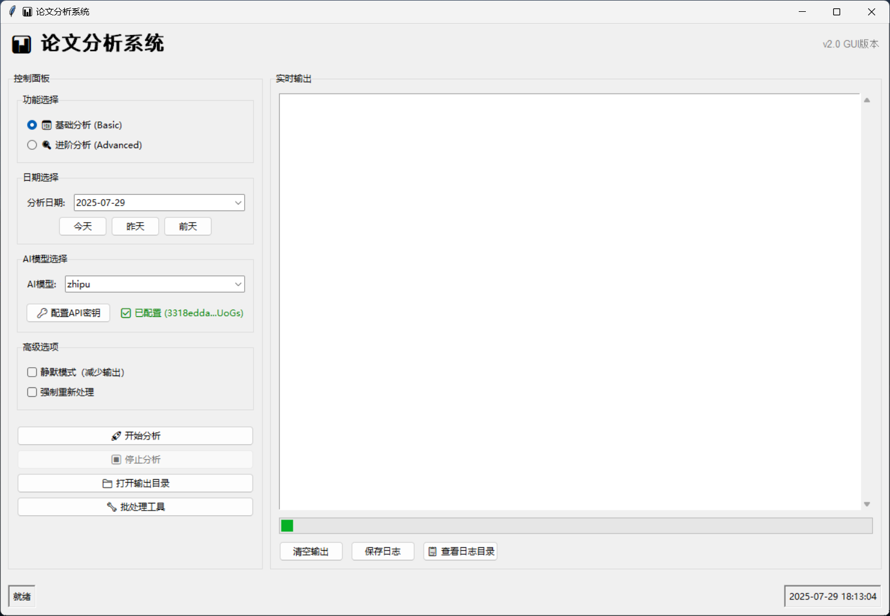

## ⚡ 30 秒快速开始

### 🎨 图形界面版（推荐新手）

```bash
python run_gui.py
```

**零门槛使用**：点击"开始分析" → 选择日期 → 等待完成 ✨

<!-- 📸 需要截图：GUI界面操作流程 -->


### 💻 命令行版（推荐专业用户）

```bash
python run.py --help
```

**一行命令搞定**：自动下载、分析、生成报告

<!-- 📸 需要截图：命令行执行过程 -->

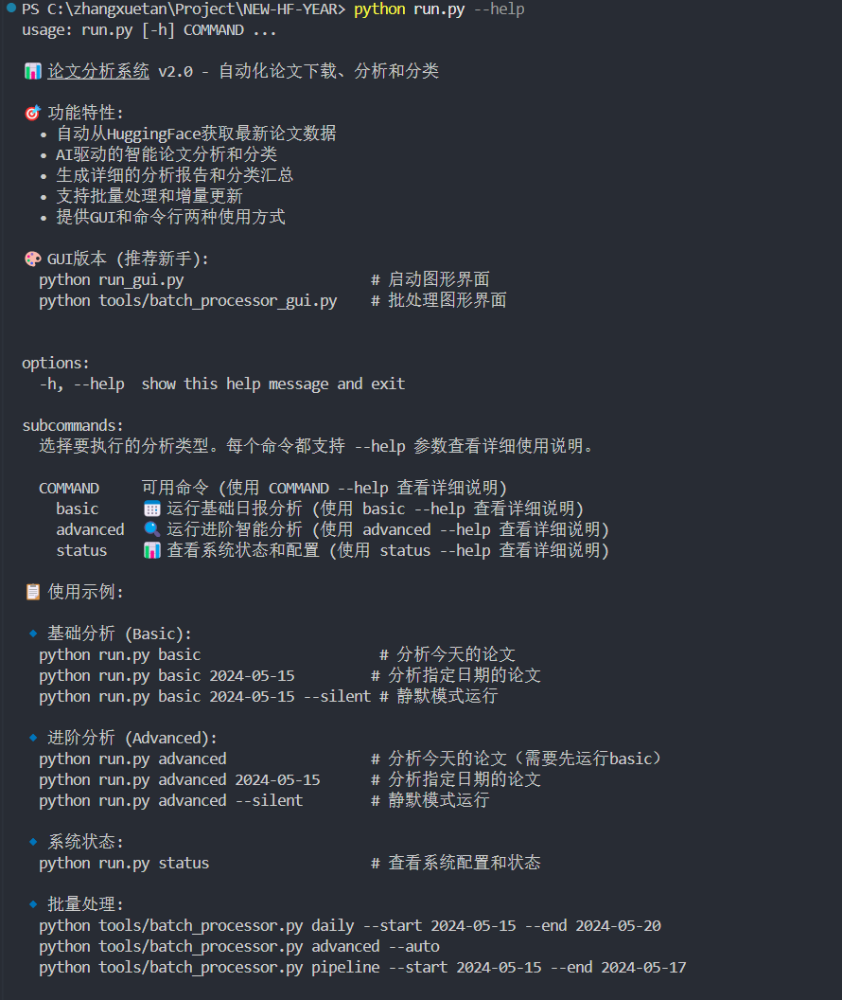
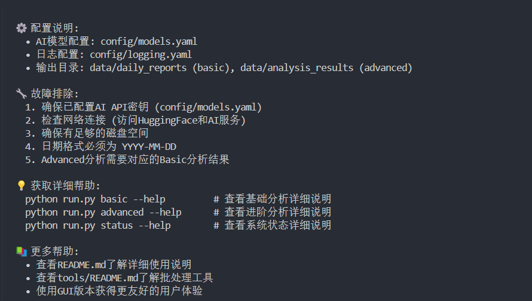

## 🎯 核心功能

| 功能              | 描述                                  | 价值                       |
| ----------------- | ------------------------------------- | -------------------------- |
| 📡 **自动获取**   | 从 HuggingFace 获取最新论文数据       | 无需手动搜索，确保不遗漏   |
| 🤖 **AI 分析**    | 支持智谱 AI、豆包、OpenAI、通义千问等 | 多模型交叉验证，提高准确性 |
| 📊 **智能分类**   | 自动标签化和主题分类                  | 快速定位感兴趣的研究方向   |
| 📈 **可视化报告** | 生成结构化的分析报告                  | 一目了然的研究趋势和热点   |
| ⚡ **批量处理**   | 支持多日期批量分析                    | 高效处理大量数据           |
| 🔄 **增量更新**   | 智能检测已处理内容                    | 避免重复工作，节省时间     |

## 🚀 适用场景

### 👨‍🔬 研究人员

- **快速了解领域动态**：每日自动获取相关论文摘要
- **发现研究热点**：AI 自动识别热门研究方向
- **跟踪竞争对手**：监控特定机构或作者的最新成果

### 👨‍💼 产品经理

- **技术趋势分析**：了解 AI 技术发展方向
- **竞品技术调研**：分析竞争对手的技术布局
- **产品规划参考**：基于最新研究制定产品路线图

### 👨‍💻 开发者

- **技术选型参考**：了解最新算法和工具
- **学习资源发现**：找到值得深入研究的论文
- **灵感来源**：从最新研究中获取项目创意

### 👨‍🎓 学生和学者

- **文献调研**：快速筛选相关研究文献
- **学习计划**：根据热点调整学习重点
- **论文写作**：了解最新研究现状和发展趋势

## 🛠️ 安装配置

### 1. 环境准备

```bash
# 克隆项目
git clone https://github.com/ZsTs119/ai-paper-analyzer.git
cd ai-paper-analyzer

# 安装依赖
pip install -r requirements.txt
```

### 2. API 密钥配置

支持多种 AI 服务，选择其中一种即可：

| AI 服务          | 环境变量            | 获取地址                                                                                                |
| ---------------- | ------------------- | ------------------------------------------------------------------------------------------------------- |
| 智谱 AI _(推荐)_ | `ZHIPUAI_API_KEY`   | [智谱 AI 开放平台](https://www.bigmodel.cn/invite?icode=hk0Lc1L7oGy17bOhwrIMDGczbXFgPRGIalpycrEwJ28%3D) |
| 豆包 AI          | `ARK_API_KEY`       | [火山引擎](https://console.volcengine.com/)                                                             |
| OpenAI           | `OPENAI_API_KEY`    | [OpenAI Platform](https://platform.openai.com/)                                                         |
| 通义千问         | `DASHSCOPE_API_KEY` | [阿里云 DashScope](https://dashscope.aliyun.com/)                                                       |

**方式一：GUI 配置（推荐）**

```bash
python run_gui.py
# 点击"配置API密钥"按钮，输入密钥并测试连接
```

<!-- 📸 需要截图：API密钥配置界面 -->

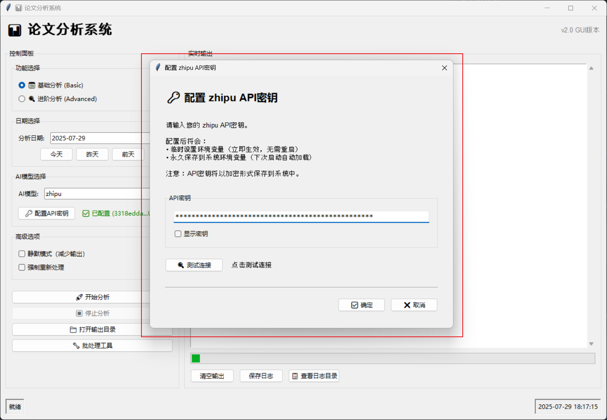

**方式二：环境变量**

```bash
# Windows
set ZHIPUAI_API_KEY=your_api_key_here

# Linux/Mac
export ZHIPUAI_API_KEY=your_api_key_here
```

### 3. 验证安装

```bash
python run.py status  # 检查系统状态
```

## 📖 使用指南

### 🎨 GUI 图形界面（零门槛）

1. **启动界面**

   ```bash
   python run_gui.py
   ```

2. **基础操作**

   - 选择 AI 模型（智谱 AI、豆包等）
   - 点击"配置 API 密钥"设置密钥
   - 选择分析日期
   - 点击"开始分析"

3. **高级功能**
   - 实时查看分析进度
   - 静默模式运行
   - 批量处理多个日期

<!-- 📸 需要截图：GUI详细操作步骤 -->

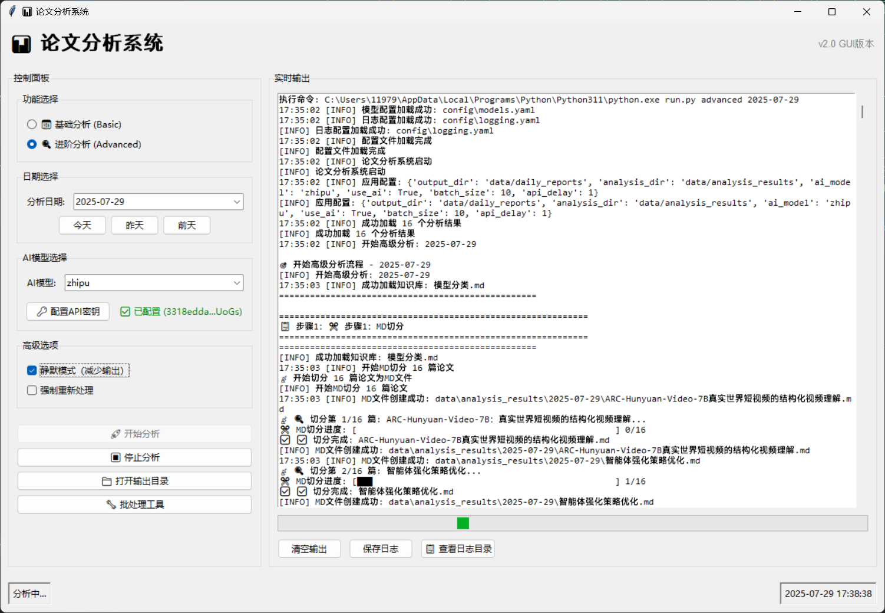
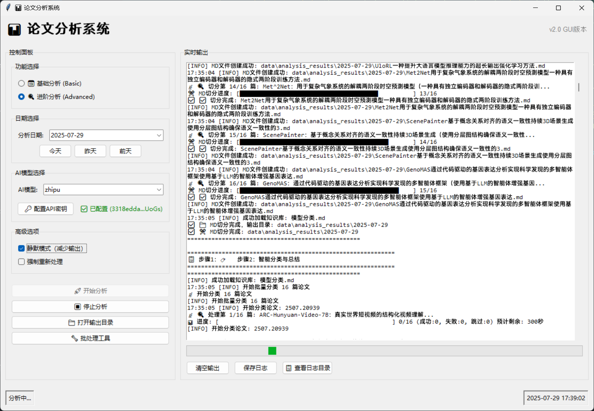
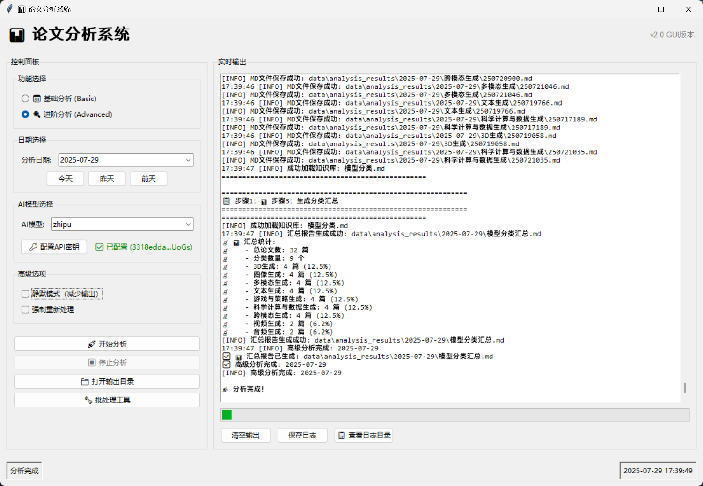

### 💻 命令行脚本（专业高效）

#### 基础分析

```bash
# 分析今天的论文
python run.py basic

# 分析指定日期
python run.py basic 2025-07-29

# 静默模式运行
python run.py basic 2025-07-29 --silent
```

#### 进阶分析

```bash
# 对基础分析结果进行深度分析
python run.py advanced 2025-07-29

# 自动模式（推荐）
python run.py advanced --auto
```

#### 批量处理

```bash
# 批量分析多个日期
python tools/batch_processor.py daily --start 2025-07-25 --end 2025-07-29

# 完整流水线处理
python tools/batch_processor.py pipeline --start 2025-07-25 --end 2025-07-27
```

#### 系统状态

```bash
# 查看配置和运行状态
python run.py status
```

<!-- 📸 需要截图：命令行执行示例 -->

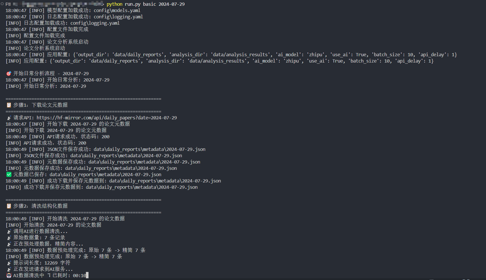
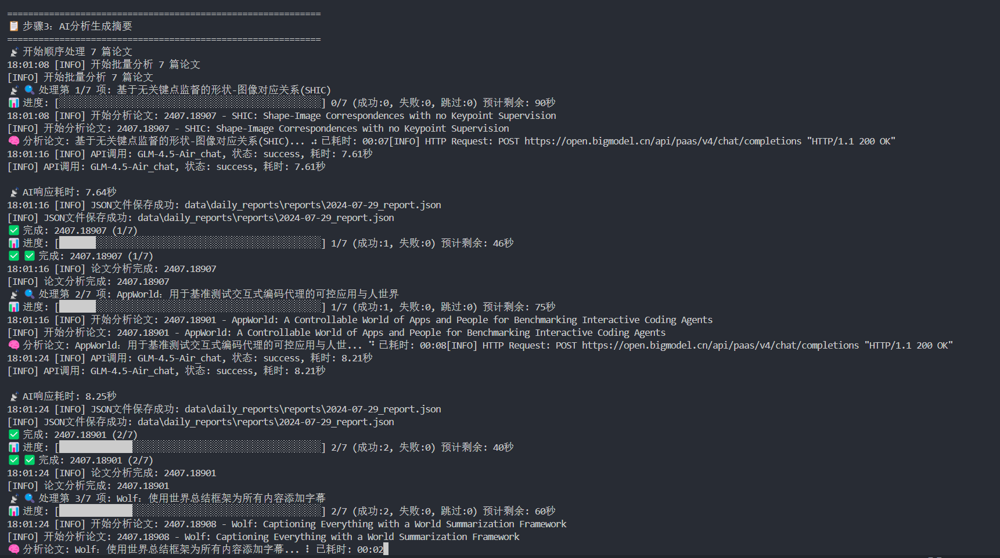
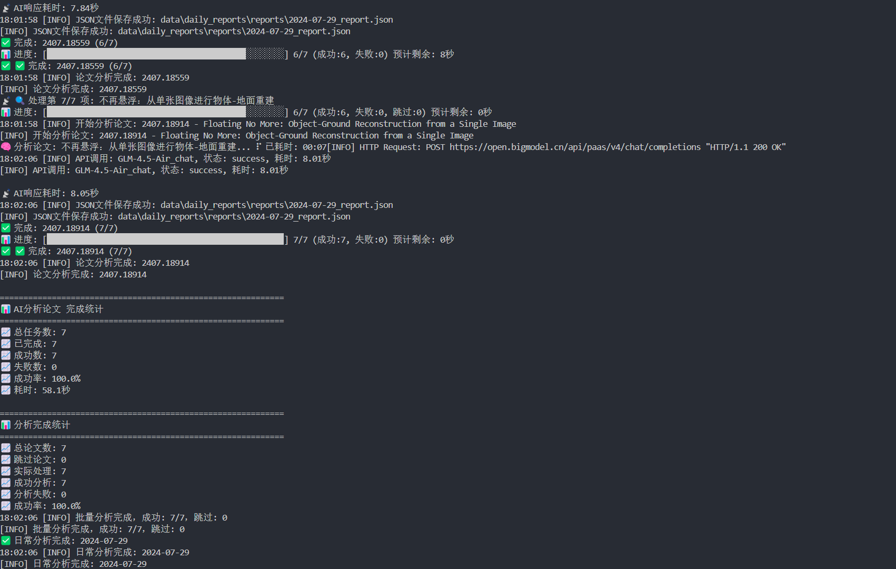

## 📊 输出结果

### 📁 文件结构

```
data/
├── daily_reports/           # 基础分析结果
│   ├── metadata/           # 原始论文元数据
│   ├── cleaned/            # 清洗后的结构化数据
│   └── reports/            # 生成的分析报告
└── analysis_results/       # 进阶分析结果
    ├── categories/         # 分类统计
    ├── trends/            # 趋势分析
    └── summaries/         # 综合报告
```

### 📋 报告内容

- **论文摘要**：AI 提取的关键信息
- **技术分类**：自动识别的研究领域
- **创新点分析**：论文的主要贡献
- **应用场景**：潜在的实际应用
- **技术成熟度**：评估技术的发展阶段
- **趋势分析**：研究热点和发展方向

<!-- 📸 需要截图：分析报告示例 -->

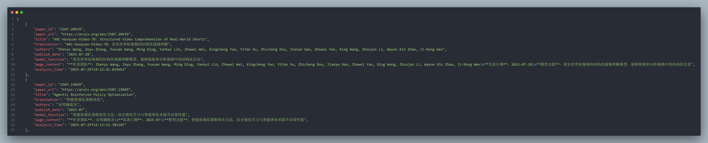


## 🔧 高级配置

### AI 模型配置

编辑 `config/models.yaml` 自定义 AI 模型参数：

```yaml
ai_models:
  zhipu:
    name: "智谱AI"
    default_model: "GLM-4.5-Air"
    api_base: "https://open.bigmodel.cn/api/paas/v4/"
    max_tokens: 4000
    temperature: 0.3
  openai:
    name: "OpenAI"
    default_model: "gpt-4"
    api_base: "https://api.openai.com/v1/"
    max_tokens: 4000
    temperature: 0.3
```

### 日志配置

编辑 `config/logging.yaml` 调整日志级别和输出格式：

```yaml
version: 1
formatters:
  default:
    format: "%(asctime)s [%(levelname)s] %(message)s"
handlers:
  console:
    class: logging.StreamHandler
    level: INFO
    formatter: default
  file:
    class: logging.FileHandler
    level: DEBUG
    formatter: default
    filename: logs/app.log
```

### 应用配置

编辑 `config/app.yaml` 修改输出目录、批处理大小等参数：

```yaml
output_dir: "data/daily_reports"
analysis_dir: "data/analysis_results"
ai_model: "zhipu"
use_ai: true
batch_size: 10
api_delay: 1
```

## 🎨 分类体系

系统支持以下智能分类：

### 🤖 AI 模型分类

- **文本生成**：大语言模型、对话系统、文本摘要
- **图像生成**：图像合成、风格转换、图像编辑
- **视频生成**：视频合成、动画生成、视频编辑
- **音频生成**：语音合成、音乐生成、音频处理
- **3D 生成**：3D 建模、场景生成、虚拟现实
- **多模态生成**：跨模态转换、多模态理解
- **跨模态生成**：文本到图像、图像到文本等
- **游戏与策略生成**：游戏 AI、策略优化
- **科学计算与数据生成**：科学模拟、数据分析

<!-- 📸 需要截图：分类结果展示 -->

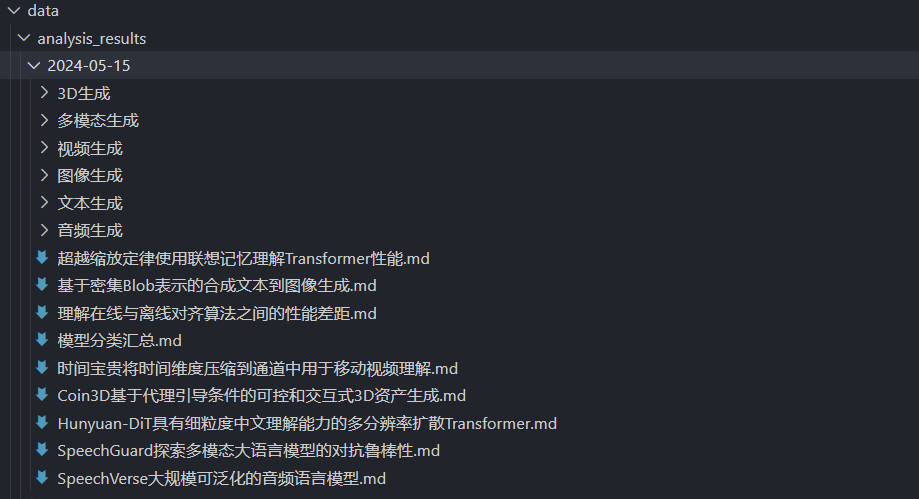

## 🎯 最佳实践

### 📅 日常使用建议

1. **每日定时运行**：建议每天早上运行前一天的分析
2. **选择合适的 AI 模型**：智谱 AI 性价比高，OpenAI 质量更好
3. **批量处理**：周末可以批量处理一周的数据
4. **定期清理**：定期清理旧的分析结果，节省存储空间

### ⚡ 性能优化

1. **并发处理**：修改 `batch_size` 参数提高处理速度
2. **API 限流**：调整 `api_delay` 避免触发 API 限制
3. **缓存利用**：重复分析会自动使用缓存结果

### 🛡️ 错误处理

1. **网络问题**：系统会自动重试，无需手动干预
2. **API 限制**：会自动降低请求频率
3. **数据异常**：异常数据会被标记并跳过

## 🔍 故障排除

### 常见问题及解决方案

#### 1. API 密钥相关问题

**问题**：提示"API 密钥无效"

```
❌ API密钥无效或已过期
```

**解决方案**：

- 检查 API 密钥是否正确复制（注意前后空格）
- 确认 API 密钥未过期且有足够余额
- 使用 GUI 的"测试连接"功能验证密钥

**问题**：提示"API 权限不足"

```
❌ API密钥权限不足，请检查模型访问权限
```

**解决方案**：

- 确认 API 密钥有访问对应模型的权限
- 联系 AI 服务提供商开通相应权限
- 尝试使用其他支持的 AI 模型

#### 2. 网络连接问题

**问题**：连接超时或网络错误

```
❌ 连接超时，请检查网络连接
❌ 网络连接失败，请检查网络设置
```

**解决方案**：

- 检查网络连接是否正常
- 确认防火墙未阻止程序访问网络
- 如在企业网络，联系网管开放相关域名访问权限
- 尝试使用 VPN 或代理

#### 3. 编码问题

**问题**：Windows 下出现编码错误

```
'gbk' codec can't encode character
```

**解决方案**：

- 确保使用 UTF-8 编码的终端
- 在 PowerShell 中运行：`chcp 65001`
- 使用 GUI 版本避免编码问题

#### 4. 依赖包问题

**问题**：缺少依赖包

```
ModuleNotFoundError: No module named 'xxx'
```

**解决方案**：

```bash
# 重新安装依赖
pip install -r requirements.txt

# 或单独安装缺失的包
pip install package_name
```

#### 5. 权限问题

**问题**：文件写入权限不足

```
PermissionError: [Errno 13] Permission denied
```

**解决方案**：

- 确保对项目目录有写入权限
- Windows 用户可尝试以管理员身份运行
- 检查 data 目录是否存在且可写

### 📋 系统要求

#### 最低要求

- **Python**: 3.8+
- **内存**: 4GB RAM
- **存储**: 2GB 可用空间
- **网络**: 稳定的互联网连接

#### 推荐配置

- **Python**: 3.10+
- **内存**: 8GB+ RAM
- **存储**: 10GB+ 可用空间（用于存储分析结果）
- **网络**: 高速稳定网络连接

### 🐛 调试模式

启用详细日志输出：

```bash
# 设置日志级别为DEBUG
export LOG_LEVEL=DEBUG

# 或在配置文件中修改
# config/logging.yaml
```

查看详细错误信息：

```bash
# 使用--verbose参数
python run.py basic 2025-07-29 --verbose

# 查看日志文件
tail -f logs/app.log
```

## 🤝 贡献指南

欢迎提交 Issue 和 Pull Request！

### 开发环境搭建

```bash
# 安装开发依赖
pip install -r requirements-dev.txt

# 运行测试
python -m pytest tests/

# 代码格式化
black src/ tests/
```

### 提交规范

- 功能开发：`feat: 添加新功能`
- 问题修复：`fix: 修复某个问题`
- 文档更新：`docs: 更新文档`

## ❓ 常见问题 (FAQ)

### Q1: 支持哪些 AI 模型？

**A**: 目前支持以下 AI 模型：

- **智谱 AI**: GLM-4.5-Air, GLM-4 等
- **豆包 AI**: doubao-pro-32k 等
- **OpenAI**: GPT-4, GPT-3.5-turbo 等
- **通义千问**: qwen-plus, qwen-turbo 等
- **文心一言**: 需要额外配置 secret_key
- **腾讯混元**: 需要额外配置 secret_key 和签名算法

### Q2: 每天能处理多少篇论文？

**A**: 处理能力取决于：

- **API 限制**: 各 AI 服务商的调用频率限制
- **网络速度**: 下载和上传数据的速度
- **硬件配置**: CPU 和内存影响处理速度
- 通常每天可处理 50-200 篇论文

### Q3: 分析结果的准确性如何？

**A**: 分析准确性取决于：

- **AI 模型质量**: GPT-4 > 智谱 AI > 其他模型
- **论文质量**: 结构清晰的论文分析效果更好
- **提示词优化**: 系统使用专门优化的提示词
- 建议使用多个模型交叉验证重要结果

### Q4: 如何提高处理速度？

**A**: 优化建议：

- 增加`batch_size`参数（注意 API 限制）
- 使用更快的 AI 模型（如智谱 AI）
- 确保网络连接稳定
- 使用 SSD 存储提高 I/O 速度

### Q5: 数据存储在哪里？

**A**: 所有数据存储在本地：

- **原始数据**: `data/daily_reports/metadata/`
- **清洗数据**: `data/daily_reports/cleaned/`
- **分析结果**: `data/daily_reports/reports/`
- **分类结果**: `data/analysis_results/`

### Q6: 如何备份和恢复数据？

**A**: 备份建议：

```bash
# 备份所有数据
tar -czf backup_$(date +%Y%m%d).tar.gz data/

# 恢复数据
tar -xzf backup_20250729.tar.gz
```

### Q7: 可以自定义分类吗？

**A**: 可以通过修改提示词自定义分类：

- 编辑 `src/core/classifier.py` 中的分类提示词
- 修改分类知识库内容
- 重新训练或调整 AI 模型参数

### Q8: 支持离线使用吗？

**A**: 部分功能支持离线：

- **数据下载**: 需要网络连接
- **AI 分析**: 需要调用在线 AI 服务
- **结果查看**: 可以离线查看已生成的结果
- **批量处理**: 可以离线处理已下载的数据（不含 AI 分析）

### Q9: 如何处理大量历史数据？

**A**: 批量处理建议：

```bash
# 使用批处理工具
python tools/batch_processor.py daily --start 2025-01-01 --end 2025-07-29

# 分批处理避免API限制
python tools/batch_processor.py daily --start 2025-01-01 --end 2025-01-31
python tools/batch_processor.py daily --start 2025-02-01 --end 2025-02-28
```

### Q10: 遇到问题如何获取帮助？

**A**: 获取帮助的方式：

1. **查看文档**: 阅读本 README 和 tools/README.md
2. **检查日志**: 查看 logs/app.log 文件
3. **提交 Issue**: 在 GitHub 上提交详细的问题描述
4. **社区讨论**: 参与项目讨论区
5. **联系开发者**: 通过邮件或其他方式联系

## 📈 性能基准

### 处理速度参考

| 配置       | 论文数量 | 处理时间   | 平均速度        |
| ---------- | -------- | ---------- | --------------- |
| 基础配置   | 50 篇    | 15-20 分钟 | 2.5-3.3 篇/分钟 |
| 推荐配置   | 100 篇   | 25-35 分钟 | 2.9-4 篇/分钟   |
| 高性能配置 | 200 篇   | 45-60 分钟 | 3.3-4.4 篇/分钟 |

### 资源使用

- **内存使用**: 通常 200-500MB
- **存储空间**: 每篇论文约 1-2MB 分析结果
- **网络流量**: 每篇论文约 100-500KB

## 📄 许可证

本项目采用 [MIT License](LICENSE) 开源协议。

## 🙏 致谢

- [HuggingFace](https://huggingface.co/) - 提供论文数据源
- [智谱 AI](https://open.bigmodel.cn/) - AI 分析服务
- 所有贡献者和用户的支持

## 👨‍💻 作者

- ZsTs119
- Email: zsts@foxmail.com
- GitHub: https://github.com/ZsTs119

---

⭐ 如果这个项目对你有帮助，请给我们一个 Star！

📧 有问题或建议？欢迎提交 [Issue](../../issues) 或联系我们。
