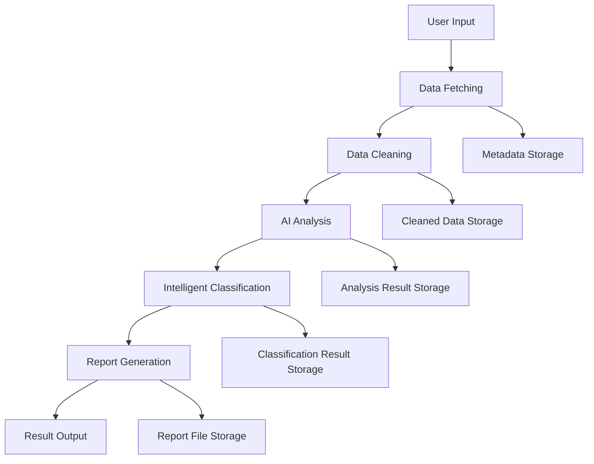

# 🏗️ AI Paper Intelligence Analysis System - Technical Architecture Design

<div align="center">

[English](./ARCHITECTURE.en.md) | [简体中文](./ARCHITECTURE.v2.md) | [This page（old version）](./ARCHITECTURE.md)

</div>

> 提示：本页为旧版架构文档。若需与当前代码实现（v2.0/v2.1）完全对齐、包含模块-文件映射、Rage Mode 并发与缓存策略、最新数据模型等，请阅读新版文档：
>
> - 最新中文：docs/ARCHITECTURE.v2.md
> - English（保持原链）：docs/ARCHITECTURE.en.md

## 📋 Table of Contents

- [System Overview](#system-overview)
- [Overall Architecture](#overall-architecture)
- [Core Module Design](#core-module-design)
- [Data Flow Design](#data-flow-design)
- [Technology Stack](#technology-stack)
- [Deployment Architecture](#deployment-architecture)
- [Performance Optimization](#performance-optimization)
- [Security Design](#security-design)
- [Extensibility Design](#extensibility-design)

## 🎯 System Overview

### System Positioning

The AI Paper Intelligence Analysis System is an intelligent paper processing tool designed for researchers, product managers, developers, and scholars. By integrating multiple AI models, it achieves automatic paper fetching, analysis, classification, and report generation.

### Core Value

- **Automation**: Reduce manual paper screening workload
- **Intelligence**: AI-driven content analysis and classification
- **Standardization**: Unified analysis report format
- **Efficiency**: Batch processing and incremental updates

### System Boundaries

```
Input: HuggingFace paper data, user configuration
Processing: Data cleaning, AI analysis, intelligent classification
Output: Structured reports, classification files, statistical data
```

## 🏛️ Overall Architecture

### Architecture Diagram

```
┌─────────────────────────────────────────────────────────────┐
│                    User Interface Layer                      │
├─────────────────────┬───────────────────────────────────────┤
│   GUI Interface    │         CLI Interface                 │
│   (Tkinter)        │         (Argparse)                   │
└─────────────────────┴───────────────────────────────────────┘
                              │
┌─────────────────────────────────────────────────────────────┐
│                   Business Logic Layer                       │
├─────────────────────┬─────────────────┬───────────────────────┤
│   Main Controller  │   Batch Processor│   Report Generator   │
│   (main.py)        │   (batch_*.py)   │   (report.py)        │
└─────────────────────┴─────────────────┴───────────────────────┘
                              │
┌─────────────────────────────────────────────────────────────┐
│                     Core Service Layer                       │
├─────────────┬─────────────┬─────────────┬───────────────────┤
│  Data Fetcher│  Analyzer   │ Classifier  │   Parser         │
│  (fetcher.py)│(analyzer.py)│(classifier.py)│ (parser.py)    │
└─────────────┴─────────────┴─────────────┴───────────────────┘
                              │
┌─────────────────────────────────────────────────────────────┐
│                 Infrastructure Layer                         │
├─────────────┬─────────────┬─────────────┬───────────────────┤
│ AI Clients  │File Manager │   Logger    │   Config Manager │
│(ai_client.py)│(file_utils.py)│(logger.py)│  (config.py)    │
└─────────────┴─────────────┴─────────────┴───────────────────┘
                              │
┌─────────────────────────────────────────────────────────────┐
│                     Data Storage Layer                       │
├─────────────┬─────────────┬─────────────┬───────────────────┤
│   Metadata  │   Cleaned   │   Reports   │   Analysis       │
│   (JSON)    │   (JSON)    │   (JSON)    │   (Markdown)     │
└─────────────┴─────────────┴─────────────┴───────────────────┘
```

### Architecture Features

1. **Layered Architecture**: Clear separation of responsibilities, easy to maintain and test
2. **Modular Design**: Each module has single responsibility, high cohesion and low coupling
3. **Pluggable AI**: Support hot-swapping of multiple AI models
4. **Data-Driven**: Flexible configuration based on configuration files

## 🧩 Core Module Design

### 1. Data Fetcher Module

**Responsibility**: Fetch paper metadata from HuggingFace

**Core Classes**:

```python
class HuggingFaceFetcher:
    def fetch_daily_papers(self, date: str) -> List[Paper]
    def fetch_paper_details(self, paper_id: str) -> PaperDetail
    def validate_paper_data(self, data: dict) -> bool
```

**Design Points**:

- Support incremental fetching to avoid duplicate downloads
- Network exception retry mechanism
- Data validation and cleaning
- Support proxy and timeout configuration

### 2. Data Cleaner Module

**Responsibility**: Clean and standardize raw paper data

**Core Classes**:

```python
class DataCleaner:
    def clean_metadata(self, raw_data: List[dict]) -> List[dict]
    def normalize_fields(self, paper: dict) -> dict
    def filter_invalid_papers(self, papers: List[dict]) -> List[dict]
```

**Design Points**:

- Field standardization and format unification
- Invalid data filtering
- Duplicate data removal
- Data quality assessment

### 3. AI Analysis Module

**Responsibility**: Analyze paper content using AI models

**Core Classes**:

```python
class PaperAnalyzer:
    def analyze_batch(self, papers: List[Paper]) -> List[AnalysisResult]
    def analyze_single(self, paper: Paper) -> AnalysisResult
    def _build_analysis_prompt(self, paper: Paper) -> str
```

**Design Points**:

- Multiple AI model support (Strategy pattern)
- Batch processing optimization
- Error retry and fallback
- Result caching mechanism

### 4. Intelligent Classification Module

**Responsibility**: Intelligently classify analysis results

**Core Classes**:

```python
class PaperClassifier:
    def classify_papers(self, results: List[AnalysisResult]) -> List[ClassificationResult]
    def classify_single_paper(self, result: AnalysisResult) -> ClassificationResult
    def save_classification_results(self, results: List[ClassificationResult]) -> bool
```

**Design Points**:

- AI-based intelligent classification
- Configurable classification system
- Classification confidence assessment
- Classification result visualization

### 5. AI Client Module

**Responsibility**: Unified AI service interface

**Core Interface**:

```python
class AIClient(ABC):
    @abstractmethod
    def chat(self, messages: List[dict]) -> str

    @abstractmethod
    def test_connection(self) -> bool
```

**Implementation Classes**:

- `ZhipuAIClient`: Zhipu AI client
- `DoubaoAIClient`: Doubao AI client
- `OpenAIClient`: OpenAI client
- `QwenAIClient`: Qwen client

**Design Points**:

- Unified interface for easy switching
- Retry and rate limiting mechanism
- Error handling and logging
- Configurable parameter management

## 🔄 Data Flow Design

### Main Data Flow



### Data Model Design

**Paper Model**:

```python
@dataclass
class Paper:
    id: str
    title: str
    translation: str
    authors: str
    url: str
    abstract: str
    created_at: datetime
```

**AnalysisResult Model**:

```python
@dataclass
class AnalysisResult:
    paper_id: str
    paper_url: str
    title: str
    translation: str
    authors: str
    publish_date: str
    model_function: str
    page_content: str
    analysis_time: str
```

**ClassificationResult Model**:

```python
@dataclass
class ClassificationResult:
    paper_id: str
    category: str
    confidence: float
    md_content: str
    classification_time: str
```

### Storage Structure Design

```
data/
├── daily_reports/              # Basic analysis data
│   ├── metadata/              # Raw metadata
│   │   └── YYYY-MM-DD.json
│   ├── cleaned/               # Cleaned data
│   │   └── YYYY-MM-DD.json
│   └── reports/               # Analysis reports
│       └── YYYY-MM-DD_report.json
├── analysis_results/          # Classification analysis results
│   └── YYYY-MM-DD/
│       ├── Text Generation/
│       ├── Image Generation/
│       ├── Video Generation/
│       └── classification_stats.json
└── logs/                      # System logs
    ├── app.log
    ├── error.log
    └── performance.log
```

## 🛠️ Technology Stack

### Programming Language

- **Python 3.8+**: Main development language
  - Rich AI/ML ecosystem
  - Excellent async support
  - Cross-platform compatibility

### Core Dependencies

**AI Service Integration**:

```python
# AI model clients
zhipuai>=2.0.0          # Zhipu AI
openai>=1.0.0           # OpenAI
dashscope>=1.0.0        # Qwen
volcengine>=1.0.0       # Doubao AI
```

**GUI Framework**:

```python
tkinter                 # Built-in GUI framework
tkcalendar>=1.6.0      # Date picker
```

**Data Processing**:

```python
requests>=2.28.0       # HTTP client
beautifulsoup4>=4.11.0 # HTML parsing
pandas>=1.5.0          # Data processing
```

**System Tools**:

```python
pyyaml>=6.0            # Configuration file parsing
colorama>=0.4.0        # Terminal colors
rich>=12.0.0           # Rich text display
```

### Architecture Patterns

**Design Pattern Applications**:

1. **Strategy Pattern**: Multiple AI client implementations
2. **Factory Pattern**: AI client creation
3. **Observer Pattern**: Progress notification
4. **Singleton Pattern**: Configuration management
5. **Template Method**: Data processing workflow

**Asynchronous Programming**:

```python
# Asynchronous data fetching
async def fetch_papers_async(dates: List[str]) -> List[Paper]:
    tasks = [fetch_single_date(date) for date in dates]
    results = await asyncio.gather(*tasks)
    return flatten(results)
```

## 🚀 Deployment Architecture

### Local Deployment

**System Requirements**:

```yaml
minimum:
  python: "3.8+"
  memory: "4GB"
  storage: "2GB"
  network: "stable internet"

recommended:
  python: "3.10+"
  memory: "8GB+"
  storage: "10GB+"
  network: "high-speed internet"
```

**Deployment Steps**:

```bash
# 1. Environment setup
git clone https://github.com/ZsTs119/ai-paper-analyzer.git
cd ai-paper-analyzer
python -m venv venv
source venv/bin/activate  # Linux/Mac
# venv\Scripts\activate   # Windows

# 2. Install dependencies
pip install -r requirements.txt

# 3. Configuration setup
cp config/app.yaml.example config/app.yaml
# Edit configuration file

# 4. Start application
python run_gui.py  # GUI version
python run.py basic  # CLI version
```

### Docker Deployment

**Dockerfile**:

```dockerfile
FROM python:3.10-slim

WORKDIR /app

# Install system dependencies
RUN apt-get update && apt-get install -y \
    git \
    && rm -rf /var/lib/apt/lists/*

# Copy dependency files
COPY requirements.txt .
RUN pip install --no-cache-dir -r requirements.txt

# Copy application code
COPY . .

# Create data directories
RUN mkdir -p data logs

# Set environment variables
ENV PYTHONPATH=/app
ENV PYTHONIOENCODING=utf-8

# Expose port (if web interface exists)
EXPOSE 8080

# Start command
CMD ["python", "run.py", "basic"]
```

**docker-compose.yml**:

```yaml
version: "3.8"

services:
  ai-paper-analyzer:
    build: .
    container_name: paper-analyzer
    environment:
      - ZHIPUAI_API_KEY=${ZHIPUAI_API_KEY}
      - OPENAI_API_KEY=${OPENAI_API_KEY}
    volumes:
      - ./data:/app/data
      - ./logs:/app/logs
      - ./config:/app/config
    restart: unless-stopped
```

### Cloud Deployment

**Supported Cloud Platforms**:

1. **AWS EC2**: Elastic compute instances
2. **Google Cloud Compute**: Virtual machine instances
3. **Azure VM**: Virtual machine services
4. **Alibaba Cloud ECS**: Elastic compute services

**Cloud Deployment Advantages**:

- Elastic scaling
- High availability
- Automatic backup
- Monitoring and alerting

## ⚡ Performance Optimization

### Concurrent Processing

**Async IO Optimization**:

```python
class AsyncPaperProcessor:
    def __init__(self, max_concurrent: int = 10):
        self.semaphore = asyncio.Semaphore(max_concurrent)

    async def process_papers_batch(self, papers: List[Paper]) -> List[AnalysisResult]:
        tasks = []
        for paper in papers:
            task = self._process_single_paper(paper)
            tasks.append(task)

        results = await asyncio.gather(*tasks, return_exceptions=True)
        return [r for r in results if not isinstance(r, Exception)]

    async def _process_single_paper(self, paper: Paper) -> AnalysisResult:
        async with self.semaphore:
            return await self.analyzer.analyze_async(paper)
```

**Batch Processing Optimization**:

```python
class BatchOptimizer:
    def __init__(self, batch_size: int = 10):
        self.batch_size = batch_size

    def optimize_batch_size(self, total_items: int, api_limit: int) -> int:
        """Dynamically adjust batch size"""
        optimal_size = min(self.batch_size, api_limit, total_items)
        return max(1, optimal_size)
```

### Caching Strategy

**Multi-level Caching**:

```python
class CacheManager:
    def __init__(self):
        self.memory_cache = {}  # Memory cache
        self.disk_cache_dir = Path("cache")  # Disk cache

    def get_analysis_result(self, paper_id: str) -> Optional[AnalysisResult]:
        # 1. Check memory cache
        if paper_id in self.memory_cache:
            return self.memory_cache[paper_id]

        # 2. Check disk cache
        cache_file = self.disk_cache_dir / f"{paper_id}.json"
        if cache_file.exists():
            result = self._load_from_disk(cache_file)
            self.memory_cache[paper_id] = result  # Load to memory
            return result

        return None
```

## 🔒 Security Design

### API Key Management

**Secure Storage**:

```python
class SecureKeyManager:
    def __init__(self):
        self.key_file = Path.home() / ".ai_paper_analyzer" / "keys.enc"

    def store_key(self, service: str, api_key: str):
        """Encrypt and store API key"""
        encrypted_key = self._encrypt(api_key)
        self._save_encrypted_key(service, encrypted_key)

    def get_key(self, service: str) -> Optional[str]:
        """Decrypt and retrieve API key"""
        encrypted_key = self._load_encrypted_key(service)
        if encrypted_key:
            return self._decrypt(encrypted_key)
        return None

    def _encrypt(self, data: str) -> bytes:
        """Encrypt using Fernet symmetric encryption"""
        from cryptography.fernet import Fernet
        key = self._get_or_create_key()
        f = Fernet(key)
        return f.encrypt(data.encode())

    def _decrypt(self, encrypted_data: bytes) -> str:
        """Decrypt data"""
        from cryptography.fernet import Fernet
        key = self._get_or_create_key()
        f = Fernet(key)
        return f.decrypt(encrypted_data).decode()
```

**Environment Variable Validation**:

```python
class EnvironmentValidator:
    REQUIRED_VARS = {
        'ZHIPUAI_API_KEY': r'^[a-zA-Z0-9\-_\.]+$',
        'OPENAI_API_KEY': r'^sk-[a-zA-Z0-9]+$',
        'DASHSCOPE_API_KEY': r'^sk-[a-zA-Z0-9]+$'
    }

    def validate_api_keys(self) -> Dict[str, bool]:
        """Validate API key formats"""
        results = {}
        for var_name, pattern in self.REQUIRED_VARS.items():
            value = os.getenv(var_name)
            if value:
                results[var_name] = bool(re.match(pattern, value))
            else:
                results[var_name] = False
        return results
```

### Data Security

**Sensitive Data Processing**:

```python
class DataSanitizer:
    SENSITIVE_PATTERNS = [
        r'api[_-]?key',
        r'password',
        r'token',
        r'secret'
    ]

    def sanitize_logs(self, log_content: str) -> str:
        """Clean sensitive information from logs"""
        for pattern in self.SENSITIVE_PATTERNS:
            log_content = re.sub(
                f'{pattern}["\']?[:\s=]+["\']?([^"\s,}}]+)',
                f'{pattern}=***REDACTED***',
                log_content,
                flags=re.IGNORECASE
            )
        return log_content

    def sanitize_config(self, config: dict) -> dict:
        """Clean sensitive information from configuration"""
        sanitized = config.copy()
        for key in sanitized:
            if any(pattern in key.lower() for pattern in ['key', 'password', 'token']):
                sanitized[key] = '***REDACTED***'
        return sanitized
```

## 🔧 Extensibility Design

### Plugin Architecture

**AI Model Plugin Interface**:

```python
class AIModelPlugin(ABC):
    """AI model plugin base class"""

    @property
    @abstractmethod
    def name(self) -> str:
        """Plugin name"""
        pass

    @property
    @abstractmethod
    def version(self) -> str:
        """Plugin version"""
        pass

    @abstractmethod
    def initialize(self, config: dict) -> bool:
        """Initialize plugin"""
        pass

    @abstractmethod
    def analyze_paper(self, paper: Paper) -> AnalysisResult:
        """Analyze paper"""
        pass

    @abstractmethod
    def test_connection(self) -> bool:
        """Test connection"""
        pass

class PluginManager:
    def __init__(self):
        self.plugins: Dict[str, AIModelPlugin] = {}

    def register_plugin(self, plugin: AIModelPlugin):
        """Register plugin"""
        self.plugins[plugin.name] = plugin

    def get_plugin(self, name: str) -> Optional[AIModelPlugin]:
        """Get plugin"""
        return self.plugins.get(name)

    def list_plugins(self) -> List[str]:
        """List all plugins"""
        return list(self.plugins.keys())
```

**Data Source Extension**:

```python
class DataSourcePlugin(ABC):
    """Data source plugin base class"""

    @abstractmethod
    def fetch_papers(self, date: str) -> List[Paper]:
        """Fetch paper data"""
        pass

    @abstractmethod
    def validate_data(self, data: dict) -> bool:
        """Validate data format"""
        pass

class ArxivDataSource(DataSourcePlugin):
    """ArXiv data source implementation"""

    def fetch_papers(self, date: str) -> List[Paper]:
        # ArXiv API implementation
        pass

class PubMedDataSource(DataSourcePlugin):
    """PubMed data source implementation"""

    def fetch_papers(self, date: str) -> List[Paper]:
        # PubMed API implementation
        pass
```

## 📊 Monitoring and Operations

### System Monitoring

**Performance Metrics Collection**:

```python
class MetricsCollector:
    def __init__(self):
        self.metrics = {
            'papers_processed': 0,
            'analysis_success_rate': 0.0,
            'average_processing_time': 0.0,
            'api_call_count': 0,
            'error_count': 0
        }

    def record_paper_processed(self, processing_time: float, success: bool):
        """Record paper processing metrics"""
        self.metrics['papers_processed'] += 1
        if success:
            self.metrics['analysis_success_rate'] = (
                self.metrics['analysis_success_rate'] * (self.metrics['papers_processed'] - 1) + 1
            ) / self.metrics['papers_processed']

        self.metrics['average_processing_time'] = (
            self.metrics['average_processing_time'] * (self.metrics['papers_processed'] - 1) + processing_time
        ) / self.metrics['papers_processed']

    def export_metrics(self) -> dict:
        """Export metrics data"""
        return self.metrics.copy()
```

## 🎯 Summary

### Core Advantages

1. **Modular Design**: Clear layered architecture, easy to maintain and extend
2. **Multi-AI Support**: Pluggable AI model integration solution
3. **High Performance**: Asynchronous processing and multi-level cache optimization
4. **Security and Reliability**: Comprehensive security mechanisms and error handling
5. **Easy Deployment**: Support for local, Docker, and cloud deployment
6. **Extensibility**: Plugin architecture supports feature extension

### Technical Features

- Modern technology stack based on Python 3.8+
- Asynchronous programming improves concurrent performance
- Reasonable application of multiple design patterns
- Comprehensive monitoring and operations support
- Secure API key management mechanism

### Future Development

- Microservice architecture evolution
- More AI models and data source support
- Web interface and API services
- Distributed processing capabilities
- Machine learning model optimization
