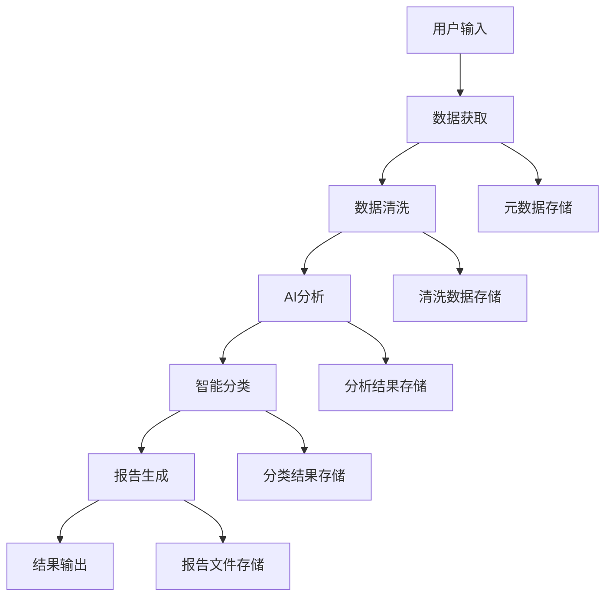

# 🏗️ AI 论文智能分析系统 - 技术架构设计

<div align="center">

[English](./ARCHITECTURE.en.md) | [简体中文](./ARCHITECTURE.md)

</div>

## 📋 目录

- [系统概述](#系统概述)
- [整体架构](#整体架构)
- [核心模块设计](#核心模块设计)
- [数据流设计](#数据流设计)
- [技术栈选型](#技术栈选型)
- [部署架构](#部署架构)
- [性能优化](#性能优化)
- [安全设计](#安全设计)
- [扩展性设计](#扩展性设计)

## 🎯 系统概述

### 系统定位

AI 论文智能分析系统是一个面向研究人员、产品经理、开发者和学者的智能化论文处理工具，通过集成多种 AI 模型，实现论文的自动获取、分析、分类和报告生成。

### 核心价值

- **自动化**：减少手动筛选论文的工作量
- **智能化**：AI 驱动的内容分析和分类
- **标准化**：统一的分析报告格式
- **高效性**：批量处理和增量更新

### 系统边界

```
输入：HuggingFace论文数据、用户配置
处理：数据清洗、AI分析、智能分类
输出：结构化报告、分类文件、统计数据
```

## 🏛️ 整体架构

### 架构图

```
┌─────────────────────────────────────────────────────────────┐
│                    用户接口层 (UI Layer)                      │
├─────────────────────┬───────────────────────────────────────┤
│   GUI Interface    │         CLI Interface                 │
│   (Tkinter)        │         (Argparse)                   │
└─────────────────────┴───────────────────────────────────────┘
                              │
┌─────────────────────────────────────────────────────────────┐
│                   业务逻辑层 (Business Layer)                 │
├─────────────────────┬─────────────────┬───────────────────────┤
│   Main Controller  │   Batch Processor│   Report Generator   │
│   (main.py)        │   (batch_*.py)   │   (report.py)        │
└─────────────────────┴─────────────────┴───────────────────────┘
                              │
┌─────────────────────────────────────────────────────────────┐
│                   核心服务层 (Core Layer)                     │
├─────────────┬─────────────┬─────────────┬───────────────────┤
│  Data Fetcher│  Analyzer   │ Classifier  │   Parser         │
│  (fetcher.py)│(analyzer.py)│(classifier.py)│ (parser.py)    │
└─────────────┴─────────────┴─────────────┴───────────────────┘
                              │
┌─────────────────────────────────────────────────────────────┐
│                   基础设施层 (Infrastructure Layer)           │
├─────────────┬─────────────┬─────────────┬───────────────────┤
│ AI Clients  │File Manager │   Logger    │   Config Manager │
│(ai_client.py)│(file_utils.py)│(logger.py)│  (config.py)    │
└─────────────┴─────────────┴─────────────┴───────────────────┘
                              │
┌─────────────────────────────────────────────────────────────┐
│                   数据存储层 (Data Layer)                     │
├─────────────┬─────────────┬─────────────┬───────────────────┤
│   Metadata  │   Cleaned   │   Reports   │   Analysis       │
│   (JSON)    │   (JSON)    │   (JSON)    │   (Markdown)     │
└─────────────┴─────────────┴─────────────┴───────────────────┘
```

### 架构特点

1. **分层架构**：清晰的职责分离，便于维护和测试
2. **模块化设计**：每个模块职责单一，高内聚低耦合
3. **插件化 AI**：支持多种 AI 模型的热插拔
4. **数据驱动**：基于配置文件的灵活配置

## 🧩 核心模块设计

### 1. 数据获取模块 (Data Fetcher)

**职责**：从 HuggingFace 获取论文元数据

**核心类**：

```python
class HuggingFaceFetcher:
    def fetch_daily_papers(self, date: str) -> List[Paper]
    def fetch_paper_details(self, paper_id: str) -> PaperDetail
    def validate_paper_data(self, data: dict) -> bool
```

**设计要点**：

- 支持增量获取，避免重复下载
- 网络异常重试机制
- 数据验证和清洗
- 支持代理和超时配置

### 2. 数据清洗模块 (Data Cleaner)

**职责**：清洗和标准化原始论文数据

**核心类**：

```python
class DataCleaner:
    def clean_metadata(self, raw_data: List[dict]) -> List[dict]
    def normalize_fields(self, paper: dict) -> dict
    def filter_invalid_papers(self, papers: List[dict]) -> List[dict]
```

**设计要点**：

- 字段标准化和格式统一
- 无效数据过滤
- 重复数据去除
- 数据质量评估

### 3. AI 分析模块 (Analyzer)

**职责**：使用 AI 模型分析论文内容

**核心类**：

```python
class PaperAnalyzer:
    def analyze_batch(self, papers: List[Paper]) -> List[AnalysisResult]
    def analyze_single(self, paper: Paper) -> AnalysisResult
    def _build_analysis_prompt(self, paper: Paper) -> str
```

**设计要点**：

- 多 AI 模型支持（策略模式）
- 批量处理优化
- 错误重试和降级
- 结果缓存机制

### 4. 智能分类模块 (Classifier)

**职责**：对分析结果进行智能分类

**核心类**：

```python
class PaperClassifier:
    def classify_papers(self, results: List[AnalysisResult]) -> List[ClassificationResult]
    def classify_single_paper(self, result: AnalysisResult) -> ClassificationResult
    def save_classification_results(self, results: List[ClassificationResult]) -> bool
```

**设计要点**：

- 基于 AI 的智能分类
- 可配置的分类体系
- 分类置信度评估
- 分类结果可视化

### 5. AI 客户端模块 (AI Client)

**职责**：统一的 AI 服务接口

**核心接口**：

```python
class AIClient(ABC):
    @abstractmethod
    def chat(self, messages: List[dict]) -> str

    @abstractmethod
    def test_connection(self) -> bool
```

**实现类**：

- `ZhipuAIClient`：智谱 AI 客户端
- `DoubaoAIClient`：豆包 AI 客户端
- `OpenAIClient`：OpenAI 客户端
- `QwenAIClient`：通义千问客户端

**设计要点**：

- 统一接口，便于切换
- 重试和限流机制
- 错误处理和日志
- 配置化参数管理

## 🔄 数据流设计

### 主要数据流



### 数据模型设计

**Paper 模型**：

```python
@dataclass
class Paper:
    id: str
    title: str
    translation: str
    authors: str
    url: str
    abstract: str
    created_at: datetime
```

**AnalysisResult 模型**：

```python
@dataclass
class AnalysisResult:
    paper_id: str
    paper_url: str
    title: str
    translation: str
    authors: str
    publish_date: str
    model_function: str
    page_content: str
    analysis_time: str
```

**ClassificationResult 模型**：

```python
@dataclass
class ClassificationResult:
    paper_id: str
    category: str
    confidence: float
    md_content: str
    classification_time: str
```

### 存储结构设计

```
data/
├── daily_reports/              # 基础分析数据
│   ├── metadata/              # 原始元数据
│   │   └── YYYY-MM-DD.json
│   ├── cleaned/               # 清洗后数据
│   │   └── YYYY-MM-DD.json
│   └── reports/               # 分析报告
│       └── YYYY-MM-DD_report.json
├── analysis_results/          # 分类分析结果
│   └── YYYY-MM-DD/
│       ├── 文本生成/
│       ├── 图像生成/
│       ├── 视频生成/
│       └── classification_stats.json
└── logs/                      # 系统日志
    ├── app.log
    ├── error.log
    └── performance.log
```

## 🛠️ 技术栈选型

### 编程语言

- **Python 3.8+**：主要开发语言
  - 丰富的 AI/ML 生态
  - 优秀的异步支持
  - 跨平台兼容性

### 核心依赖

**AI 服务集成**：

```python
# AI模型客户端
zhipuai>=2.0.0          # 智谱AI
openai>=1.0.0           # OpenAI
dashscope>=1.0.0        # 通义千问
volcengine>=1.0.0       # 豆包AI
```

**GUI 框架**：

```python
tkinter                 # 内置GUI框架
tkcalendar>=1.6.0      # 日期选择器
```

**数据处理**：

```python
requests>=2.28.0       # HTTP客户端
beautifulsoup4>=4.11.0 # HTML解析
pandas>=1.5.0          # 数据处理
```

**系统工具**：

```python
pyyaml>=6.0            # 配置文件解析
colorama>=0.4.0        # 终端颜色
rich>=12.0.0           # 富文本显示
```

### 架构模式

**设计模式应用**：

1. **策略模式**：AI 客户端的多实现
2. **工厂模式**：AI 客户端创建
3. **观察者模式**：进度通知
4. **单例模式**：配置管理
5. **模板方法**：数据处理流程

**异步编程**：

```python
# 异步数据获取
async def fetch_papers_async(dates: List[str]) -> List[Paper]:
    tasks = [fetch_single_date(date) for date in dates]
    results = await asyncio.gather(*tasks)
    return flatten(results)
```

## 🚀 部署架构

### 本地部署

**系统要求**：

```yaml
minimum:
  python: "3.8+"
  memory: "4GB"
  storage: "2GB"
  network: "stable internet"

recommended:
  python: "3.10+"
  memory: "8GB+"
  storage: "10GB+"
  network: "high-speed internet"
```

**部署步骤**：

```bash
# 1. 环境准备
git clone https://github.com/ZsTs119/ai-paper-analyzer.git
cd ai-paper-analyzer
python -m venv venv
source venv/bin/activate  # Linux/Mac
# venv\Scripts\activate   # Windows

# 2. 依赖安装
pip install -r requirements.txt

# 3. 配置设置
cp config/app.yaml.example config/app.yaml
# 编辑配置文件

# 4. 启动应用
python run_gui.py  # GUI版本
python run.py basic  # CLI版本
```

### Docker 部署

**Dockerfile**：

```dockerfile
FROM python:3.10-slim

WORKDIR /app

# 安装系统依赖
RUN apt-get update && apt-get install -y \
    git \
    && rm -rf /var/lib/apt/lists/*

# 复制依赖文件
COPY requirements.txt .
RUN pip install --no-cache-dir -r requirements.txt

# 复制应用代码
COPY . .

# 创建数据目录
RUN mkdir -p data logs

# 设置环境变量
ENV PYTHONPATH=/app
ENV PYTHONIOENCODING=utf-8

# 暴露端口（如果有Web界面）
EXPOSE 8080

# 启动命令
CMD ["python", "run.py", "basic"]
```

**docker-compose.yml**：

```yaml
version: "3.8"

services:
  ai-paper-analyzer:
    build: .
    container_name: paper-analyzer
    environment:
      - ZHIPUAI_API_KEY=${ZHIPUAI_API_KEY}
      - OPENAI_API_KEY=${OPENAI_API_KEY}
    volumes:
      - ./data:/app/data
      - ./logs:/app/logs
      - ./config:/app/config
    restart: unless-stopped
```

### 云部署

**支持的云平台**：

1. **AWS EC2**：弹性计算实例
2. **Google Cloud Compute**：虚拟机实例
3. **Azure VM**：虚拟机服务
4. **阿里云 ECS**：弹性计算服务

**云部署优势**：

- 弹性扩缩容
- 高可用性
- 自动备份
- 监控告警

## ⚡ 性能优化

### 并发处理

**异步 IO 优化**：

```python
class AsyncPaperProcessor:
    def __init__(self, max_concurrent: int = 10):
        self.semaphore = asyncio.Semaphore(max_concurrent)

    async def process_papers_batch(self, papers: List[Paper]) -> List[AnalysisResult]:
        tasks = []
        for paper in papers:
            task = self._process_single_paper(paper)
            tasks.append(task)

        results = await asyncio.gather(*tasks, return_exceptions=True)
        return [r for r in results if not isinstance(r, Exception)]

    async def _process_single_paper(self, paper: Paper) -> AnalysisResult:
        async with self.semaphore:
            return await self.analyzer.analyze_async(paper)
```

**批量处理优化**：

```python
class BatchOptimizer:
    def __init__(self, batch_size: int = 10):
        self.batch_size = batch_size

    def optimize_batch_size(self, total_items: int, api_limit: int) -> int:
        """动态调整批次大小"""
        optimal_size = min(self.batch_size, api_limit, total_items)
        return max(1, optimal_size)
```

### 缓存策略

**多级缓存**：

```python
class CacheManager:
    def __init__(self):
        self.memory_cache = {}  # 内存缓存
        self.disk_cache_dir = Path("cache")  # 磁盘缓存

    def get_analysis_result(self, paper_id: str) -> Optional[AnalysisResult]:
        # 1. 检查内存缓存
        if paper_id in self.memory_cache:
            return self.memory_cache[paper_id]

        # 2. 检查磁盘缓存
        cache_file = self.disk_cache_dir / f"{paper_id}.json"
        if cache_file.exists():
            result = self._load_from_disk(cache_file)
            self.memory_cache[paper_id] = result  # 加载到内存
            return result

        return None
```

### 资源管理

**内存优化**：

```python
class MemoryManager:
    def __init__(self, max_memory_mb: int = 500):
        self.max_memory = max_memory_mb * 1024 * 1024

    def check_memory_usage(self):
        """监控内存使用"""
        import psutil
        process = psutil.Process()
        memory_usage = process.memory_info().rss

        if memory_usage > self.max_memory:
            self._cleanup_cache()

    def _cleanup_cache(self):
        """清理缓存释放内存"""
        # 清理最久未使用的缓存项
        pass
```

**连接池管理**：

```python
class ConnectionPoolManager:
    def __init__(self, max_connections: int = 10):
        self.session = requests.Session()
        adapter = requests.adapters.HTTPAdapter(
            pool_connections=max_connections,
            pool_maxsize=max_connections,
            max_retries=3
        )
        self.session.mount('http://', adapter)
        self.session.mount('https://', adapter)
```

## 🔒 安全设计

### API 密钥管理

**安全存储**：

```python
class SecureKeyManager:
    def __init__(self):
        self.key_file = Path.home() / ".ai_paper_analyzer" / "keys.enc"

    def store_key(self, service: str, api_key: str):
        """加密存储API密钥"""
        encrypted_key = self._encrypt(api_key)
        self._save_encrypted_key(service, encrypted_key)

    def get_key(self, service: str) -> Optional[str]:
        """解密获取API密钥"""
        encrypted_key = self._load_encrypted_key(service)
        if encrypted_key:
            return self._decrypt(encrypted_key)
        return None

    def _encrypt(self, data: str) -> bytes:
        """使用Fernet对称加密"""
        from cryptography.fernet import Fernet
        key = self._get_or_create_key()
        f = Fernet(key)
        return f.encrypt(data.encode())

    def _decrypt(self, encrypted_data: bytes) -> str:
        """解密数据"""
        from cryptography.fernet import Fernet
        key = self._get_or_create_key()
        f = Fernet(key)
        return f.decrypt(encrypted_data).decode()
```

**环境变量验证**：

```python
class EnvironmentValidator:
    REQUIRED_VARS = {
        'ZHIPUAI_API_KEY': r'^[a-zA-Z0-9\-_\.]+$',
        'OPENAI_API_KEY': r'^sk-[a-zA-Z0-9]+$',
        'DASHSCOPE_API_KEY': r'^sk-[a-zA-Z0-9]+$'
    }

    def validate_api_keys(self) -> Dict[str, bool]:
        """验证API密钥格式"""
        results = {}
        for var_name, pattern in self.REQUIRED_VARS.items():
            value = os.getenv(var_name)
            if value:
                results[var_name] = bool(re.match(pattern, value))
            else:
                results[var_name] = False
        return results
```

### 数据安全

**敏感数据处理**：

```python
class DataSanitizer:
    SENSITIVE_PATTERNS = [
        r'api[_-]?key',
        r'password',
        r'token',
        r'secret'
    ]

    def sanitize_logs(self, log_content: str) -> str:
        """清理日志中的敏感信息"""
        for pattern in self.SENSITIVE_PATTERNS:
            log_content = re.sub(
                f'{pattern}["\']?[:\s=]+["\']?([^"\s,}}]+)',
                f'{pattern}=***REDACTED***',
                log_content,
                flags=re.IGNORECASE
            )
        return log_content

    def sanitize_config(self, config: dict) -> dict:
        """清理配置中的敏感信息"""
        sanitized = config.copy()
        for key in sanitized:
            if any(pattern in key.lower() for pattern in ['key', 'password', 'token']):
                sanitized[key] = '***REDACTED***'
        return sanitized
```

### 网络安全

**请求验证**：

```python
class SecureHTTPClient:
    def __init__(self):
        self.session = requests.Session()
        self.session.verify = True  # 强制SSL验证
        self.session.timeout = 30   # 设置超时

        # 设置安全头
        self.session.headers.update({
            'User-Agent': 'AI-Paper-Analyzer/1.0',
            'Accept': 'application/json',
            'Content-Type': 'application/json'
        })

    def make_request(self, url: str, **kwargs) -> requests.Response:
        """安全的HTTP请求"""
        # URL白名单验证
        if not self._is_allowed_url(url):
            raise SecurityError(f"URL not in whitelist: {url}")

        # 请求大小限制
        if 'data' in kwargs and len(str(kwargs['data'])) > 1024 * 1024:  # 1MB
            raise SecurityError("Request payload too large")

        return self.session.request('POST', url, **kwargs)

    def _is_allowed_url(self, url: str) -> bool:
        """检查URL是否在白名单中"""
        allowed_domains = [
            'api.openai.com',
            'open.bigmodel.cn',
            'dashscope.aliyuncs.com',
            'ark.cn-beijing.volces.com',
            'huggingface.co'
        ]
        from urllib.parse import urlparse
        domain = urlparse(url).netloc
        return any(allowed in domain for allowed in allowed_domains)
```

## 🔧 扩展性设计

### 插件化架构

**AI 模型插件接口**：

```python
class AIModelPlugin(ABC):
    """AI模型插件基类"""

    @property
    @abstractmethod
    def name(self) -> str:
        """插件名称"""
        pass

    @property
    @abstractmethod
    def version(self) -> str:
        """插件版本"""
        pass

    @abstractmethod
    def initialize(self, config: dict) -> bool:
        """初始化插件"""
        pass

    @abstractmethod
    def analyze_paper(self, paper: Paper) -> AnalysisResult:
        """分析论文"""
        pass

    @abstractmethod
    def test_connection(self) -> bool:
        """测试连接"""
        pass

class PluginManager:
    def __init__(self):
        self.plugins: Dict[str, AIModelPlugin] = {}

    def register_plugin(self, plugin: AIModelPlugin):
        """注册插件"""
        self.plugins[plugin.name] = plugin

    def get_plugin(self, name: str) -> Optional[AIModelPlugin]:
        """获取插件"""
        return self.plugins.get(name)

    def list_plugins(self) -> List[str]:
        """列出所有插件"""
        return list(self.plugins.keys())
```

**数据源扩展**：

```python
class DataSourcePlugin(ABC):
    """数据源插件基类"""

    @abstractmethod
    def fetch_papers(self, date: str) -> List[Paper]:
        """获取论文数据"""
        pass

    @abstractmethod
    def validate_data(self, data: dict) -> bool:
        """验证数据格式"""
        pass

class ArxivDataSource(DataSourcePlugin):
    """ArXiv数据源实现"""

    def fetch_papers(self, date: str) -> List[Paper]:
        # ArXiv API实现
        pass

class PubMedDataSource(DataSourcePlugin):
    """PubMed数据源实现"""

    def fetch_papers(self, date: str) -> List[Paper]:
        # PubMed API实现
        pass
```

### 配置化扩展

**动态配置加载**：

```python
class ConfigurableSystem:
    def __init__(self, config_dir: str = "config"):
        self.config_dir = Path(config_dir)
        self.watchers = {}

    def load_plugin_configs(self) -> Dict[str, dict]:
        """加载插件配置"""
        configs = {}
        plugin_config_dir = self.config_dir / "plugins"

        if plugin_config_dir.exists():
            for config_file in plugin_config_dir.glob("*.yaml"):
                plugin_name = config_file.stem
                with open(config_file, 'r', encoding='utf-8') as f:
                    configs[plugin_name] = yaml.safe_load(f)

        return configs

    def watch_config_changes(self, callback):
        """监控配置文件变化"""
        from watchdog.observers import Observer
        from watchdog.events import FileSystemEventHandler

        class ConfigHandler(FileSystemEventHandler):
            def on_modified(self, event):
                if event.src_path.endswith('.yaml'):
                    callback(event.src_path)

        observer = Observer()
        observer.schedule(ConfigHandler(), str(self.config_dir), recursive=True)
        observer.start()
        return observer
```

### 微服务化支持

**服务拆分设计**：

```python
# 数据获取服务
class DataFetchService:
    def __init__(self, port: int = 8001):
        self.app = FastAPI()
        self.port = port
        self._setup_routes()

    def _setup_routes(self):
        @self.app.post("/fetch/{date}")
        async def fetch_papers(date: str):
            fetcher = HuggingFaceFetcher()
            papers = await fetcher.fetch_daily_papers(date)
            return {"papers": [p.to_dict() for p in papers]}

# AI分析服务
class AnalysisService:
    def __init__(self, port: int = 8002):
        self.app = FastAPI()
        self.port = port
        self._setup_routes()

    def _setup_routes(self):
        @self.app.post("/analyze")
        async def analyze_papers(papers: List[dict]):
            analyzer = PaperAnalyzer(config)
            results = await analyzer.analyze_batch_async(papers)
            return {"results": [r.to_dict() for r in results]}

# 分类服务
class ClassificationService:
    def __init__(self, port: int = 8003):
        self.app = FastAPI()
        self.port = port
        self._setup_routes()

    def _setup_routes(self):
        @self.app.post("/classify")
        async def classify_papers(analysis_results: List[dict]):
            classifier = PaperClassifier(config)
            results = await classifier.classify_batch_async(analysis_results)
            return {"classifications": [r.to_dict() for r in results]}
```

## 📊 监控与运维

### 系统监控

**性能指标收集**：

```python
class MetricsCollector:
    def __init__(self):
        self.metrics = {
            'papers_processed': 0,
            'analysis_success_rate': 0.0,
            'average_processing_time': 0.0,
            'api_call_count': 0,
            'error_count': 0
        }

    def record_paper_processed(self, processing_time: float, success: bool):
        """记录论文处理指标"""
        self.metrics['papers_processed'] += 1
        if success:
            self.metrics['analysis_success_rate'] = (
                self.metrics['analysis_success_rate'] * (self.metrics['papers_processed'] - 1) + 1
            ) / self.metrics['papers_processed']

        self.metrics['average_processing_time'] = (
            self.metrics['average_processing_time'] * (self.metrics['papers_processed'] - 1) + processing_time
        ) / self.metrics['papers_processed']

    def export_metrics(self) -> dict:
        """导出指标数据"""
        return self.metrics.copy()
```

**健康检查**：

```python
class HealthChecker:
    def __init__(self):
        self.checks = {
            'database': self._check_database,
            'ai_services': self._check_ai_services,
            'disk_space': self._check_disk_space,
            'memory_usage': self._check_memory_usage
        }

    async def run_health_checks(self) -> Dict[str, bool]:
        """运行所有健康检查"""
        results = {}
        for check_name, check_func in self.checks.items():
            try:
                results[check_name] = await check_func()
            except Exception as e:
                logger.error(f"Health check {check_name} failed: {e}")
                results[check_name] = False
        return results

    async def _check_ai_services(self) -> bool:
        """检查AI服务可用性"""
        # 实现AI服务连通性检查
        pass

    async def _check_disk_space(self) -> bool:
        """检查磁盘空间"""
        import shutil
        total, used, free = shutil.disk_usage(".")
        usage_percent = (used / total) * 100
        return usage_percent < 90  # 磁盘使用率小于90%
```

## 🎯 总结

### 核心优势

1. **模块化设计**：清晰的分层架构，便于维护和扩展
2. **多 AI 支持**：插件化的 AI 模型集成方案
3. **高性能**：异步处理和多级缓存优化
4. **安全可靠**：完善的安全机制和错误处理
5. **易于部署**：支持本地、Docker 和云部署
6. **可扩展性**：插件化架构支持功能扩展

### 技术特色

- 基于 Python 3.8+的现代化技术栈
- 异步编程提升并发性能
- 多种设计模式的合理应用
- 完善的监控和运维支持
- 安全的 API 密钥管理机制

### 未来发展

- 微服务化架构演进
- 更多 AI 模型和数据源支持
- Web 界面和 API 服务
- 分布式处理能力
- 机器学习模型优化
